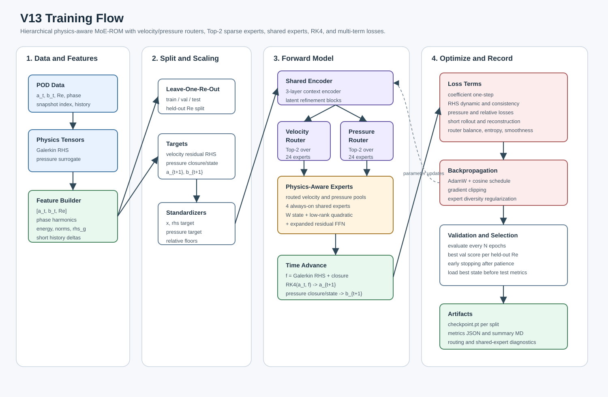
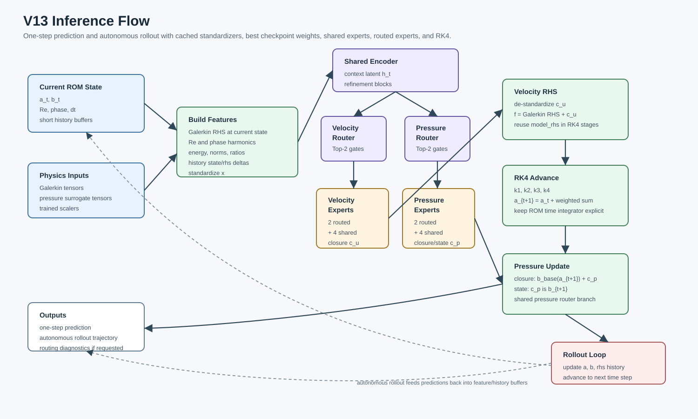

# V13 技术报告：Hierarchical Physics-Aware MoE-ROM

日期：2026-06-28

指南：`/home/ray/Downloads/deep-research-report.md`

代码：`test_results_v13/train_v13.py`

数据：`/root/moe/V8/data/Global_POD_Weighted_L2`

## 1. 目标与实现结论

V13 按研究指南在 V12 shared-expert operator-space MoE 上继续扩展：

- 扩大 encoder 和 expert 容量；
- routed experts 从 12 增加到 24，shared experts 从 2 增加到 4；
- 使用 Top-2 sparse routing；
- velocity 和 pressure 使用分离 router；
- expert 从普通 MLP 改成 physics-aware block：`linear state term + low-rank quadratic term + expanded residual FFN`；
- 保留 Galerkin RHS 物理底座和 RK4 velocity time integration；
- 增加 checkpoint 输出、compact evaluator 和 routing monitor。

最重要的结果：

- V13 closure full 主实验使 velocity autonomous one-step 在三个 held-out Re 全部低于 10%。
- Pressure direct relative L2 在 Re=120 和 Re=300 分别达到 `1.88%` 和 `4.27%`。
- 低 Re=56.3745 pressure 从 V12 best main 的 `29.45%` 降到 `27.37%`，但仍未达到 10%。
- low-Re pressure-focused ablation 未超过主实验，说明低 Re pressure 不是单靠更高 pressure loss 或减少专家数就能解决。

## 2. V13 模型结构

训练与推理流程图：

- 训练流程图：[`docs/v13_training_flow.svg`](docs/v13_training_flow.svg)
- 推理流程图：[`docs/v13_inference_flow.svg`](docs/v13_inference_flow.svg)





主结构：

```text
[a_t, b_t, Re, phase, physical descriptors, history]
  -> Shared Encoder
  -> Velocity Router pi^u_i(h, x)
  -> Pressure Router pi^p_i(h, x)
  -> Top-2 routed velocity experts + always-on shared velocity experts
  -> Top-2 routed pressure experts + always-on shared pressure experts
  -> velocity closure c_u and pressure closure/state c_p
  -> f = Galerkin RHS + c_u
  -> RK4(a_t, f)
```

每个 physics-aware expert：

```text
state = a                for velocity experts
state = [a, b]           for pressure experts

expert(state, h)
  = W state
  + low_rank_quadratic(state)
  + expanded_residual_FFN([h, state])
```

V13 代码中低秩二次项使用 rank-4 参数化：

```text
quad_o = sum_r (state @ U[o,r]) * (state @ V[o,r])
```

这样比完整三阶张量更稳，也避免参数量过大。

## 3. 运行配置

主 full 配置：

| item | value |
|---|---:|
| `r_u`, `r_p` | 16, 16 |
| hidden dim | 256 |
| routed experts | 24 |
| shared experts | 4 |
| top-k | 2 |
| expert FFN | 4 blocks, 1024 hidden |
| quadratic rank | 4 |
| velocity integrator | RK4 |
| RHS target | residual closure added to Galerkin RHS |

运行脚本：

- `run_v13_shared_operator_smoke.sh`
- `run_v13_shared_operator.sh`
- `run_v13_shared_operator_state.sh`
- `run_v13_shared_operator_lowre_pressure.sh`

辅助脚本：

- `evaluate.py`: 汇总 metrics JSON；
- `monitor_routing.py`: 输出 velocity/pressure router 和 shared-expert 使用分布。

## 4. Full Closure 主实验

Experiment: `v13_r16_hier_closure_24x4_top2`

Runtime: `7257.9 s`

| Re | Best epoch | RHS L2 | Pressure L2 | Auto a one-step | Auto b one-step | Auto a rollout | Auto b rollout |
|---:|---:|---:|---:|---:|---:|---:|---:|
| 56.3745 | 105 | 0.119795 | 0.273652 | 0.099605 | 0.300589 | 0.597859 | 0.714219 |
| 120.0 | 70 | 0.113894 | 0.018827 | 0.082553 | 0.125244 | 0.418137 | 0.462014 |
| 300.0 | 165 | 0.066140 | 0.042658 | 0.084630 | 0.095016 | 0.372106 | 0.432742 |

Routing / expert diagnostics:

| Re | Load CV | Dead experts | Max expert cosine | Shared velocity weights | Shared pressure weights |
|---:|---:|---:|---:|---|---|
| 56.3745 | 2.874 | 21 | 0.897 | `[0.830,0.072,0.055,0.044]` | `[0.028,0.253,0.674,0.044]` |
| 120.0 | 2.153 | 17 | 0.857 | `[0.243,0.262,0.261,0.235]` | `[0.306,0.111,0.284,0.299]` |
| 300.0 | 0.968 | 8 | 0.446 | `[0.389,0.108,0.045,0.459]` | `[0.438,0.178,0.194,0.189]` |

观察：

- velocity 和 pressure shared mixer 权重不同，说明分层 router/branch 确实学到了不同物理量的 regime 偏好。
- Re=300 的 expert 使用最健康，dead experts 较少；low Re 仍高度集中，说明 low-Re 流态在当前特征下更像单一窄 regime。
- expert cosine 均低于 0.95，没有整体函数塌缩。

## 5. Full State-Pressure 对照

Experiment: `v13_r16_hier_state_24x4_top2`

Runtime: `6832.7 s`

| Re | Best epoch | RHS L2 | Pressure L2 | Auto a one-step | Auto b one-step | Auto a rollout | Auto b rollout |
|---:|---:|---:|---:|---:|---:|---:|---:|
| 56.3745 | 105 | 0.116229 | 0.327070 | 0.108511 | 0.327070 | 0.644349 | 0.651632 |
| 120.0 | 105 | 0.116011 | 0.022212 | 0.083253 | 0.022212 | 0.427953 | 0.322921 |
| 300.0 | 95 | 0.066581 | 0.044028 | 0.096692 | 0.044028 | 0.592707 | 0.485447 |

State target 对 Re=120/300 autonomous pressure 更好，但低 Re pressure 更差。因此 V13 best main 仍然采用 closure target。

## 6. Low-Re Pressure Ablation

Experiment: `v13_r16_hier_lowre_pressure`

Runtime: `1749.3 s`

| Re | Best epoch | RHS L2 | Pressure L2 | Auto a one-step | Auto b one-step | Auto a rollout | Auto b rollout |
|---:|---:|---:|---:|---:|---:|---:|---:|
| 56.3745 | 95 | 0.120881 | 0.279935 | 0.102397 | 0.300686 | 0.630540 | 0.751022 |

这个 ablation 使用 16 routed + 4 shared experts、加强 pressure loss 与 pressure relative loss。结果没有超过 closure full 的 `0.273652`，说明低 Re pressure floor 不是简单 loss 权重问题。

## 7. 与 V12 对比

V12 best main: `v12_r16_shared_operator_closure_b3`

V13 best main: `v13_r16_hier_closure_24x4_top2`

| Re | V12 Pressure | V13 Pressure | V12 Auto a one-step | V13 Auto a one-step | V12 Auto b one-step | V13 Auto b one-step |
|---:|---:|---:|---:|---:|---:|---:|
| 56.3745 | 0.294464 | 0.273652 | 0.091258 | 0.099605 | 0.307380 | 0.300589 |
| 120.0 | 0.026072 | 0.018827 | 0.074845 | 0.082553 | 0.122918 | 0.125244 |
| 300.0 | 0.058756 | 0.042658 | 0.083334 | 0.084630 | 0.114990 | 0.095016 |

V13 相比 V12：

- low-Re pressure 小幅改善：`29.45% -> 27.37%`；
- Re=120 pressure 明显改善：`2.61% -> 1.88%`；
- Re=300 pressure 明显改善：`5.88% -> 4.27%`；
- velocity one-step 仍保持在 10% 内，但 low-Re velocity 接近边界：`9.96%`。

## 8. 是否达到 10% 目标

达到：

- velocity autonomous one-step：三个 Re 都低于 10%；
- pressure direct error：Re=120 和 Re=300 低于 10%；
- pressure autonomous one-step：V13 state 在 Re=120/300 低于 5%，V13 closure 在 Re=300 低于 10%。

未达到：

- low-Re pressure 仍为 `27.37%`；
- low-Re autonomous pressure 仍约 `30.06%`；
- rollout error 仍较大，尤其 low Re pressure rollout。

## 9. 对低 Re pressure 的判断

V13 已经显著增加容量、引入分层 router、shared experts 和二次物理结构，但 low-Re pressure 仍卡在 27%-33%。结合 V10/V11/V12/V13 的结果，我认为瓶颈主要不在“专家数量不够”，而在：

- low-Re pressure target 对 phase/幅值偏差极敏感；
- pressure surrogate residual 在低 Re 附近的跨 Re 外推困难；
- velocity 表征已经足够好，但 pressure closure 需要更强的 pressure-specific 物理约束；
- low-Re router 在测试 Re 上高度集中，说明该 regime 没有通过更多专家自然展开。

下一步更有效的方向：

- 做 pressure-only local Re-band surrogate/anchor；
- 为 pressure branch 增加显式 Poisson residual 或 algebraic pressure operator loss；
- 对 low-Re 使用相位对齐/幅值归一化的 pressure loss；
- 尝试 pressure `r_p=24/32` 但只把高阶 pressure mode 作为辅助监督，不直接改变主评估口径；
- 增加 low-Re 邻域 Re 的 leave-neighborhood validation，而不是单点 held-out。

## 10. 文件与 checkpoint

GitHub 产物包含源码、脚本、metrics、summary、run logs 和报告。

大 checkpoint 文件保留在集群，不直接推 GitHub，原因是单文件约 337-471MB，超过普通 GitHub 文件限制。

Checkpoint 位置：

- `/root/moe/V13/test_results_v13/results/v13_r16_hier_closure_24x4_top2/*_checkpoint.pt`
- `/root/moe/V13/test_results_v13/results/v13_r16_hier_state_24x4_top2/*_checkpoint.pt`
- `/root/moe/V13/test_results_v13/results/v13_r16_hier_lowre_pressure/*_checkpoint.pt`

最终推荐参考模型：

- 主模型：`v13_r16_hier_closure_24x4_top2`
- 压力 rollout 对照：`v13_r16_hier_state_24x4_top2`
- low-Re ablation：`v13_r16_hier_lowre_pressure`
