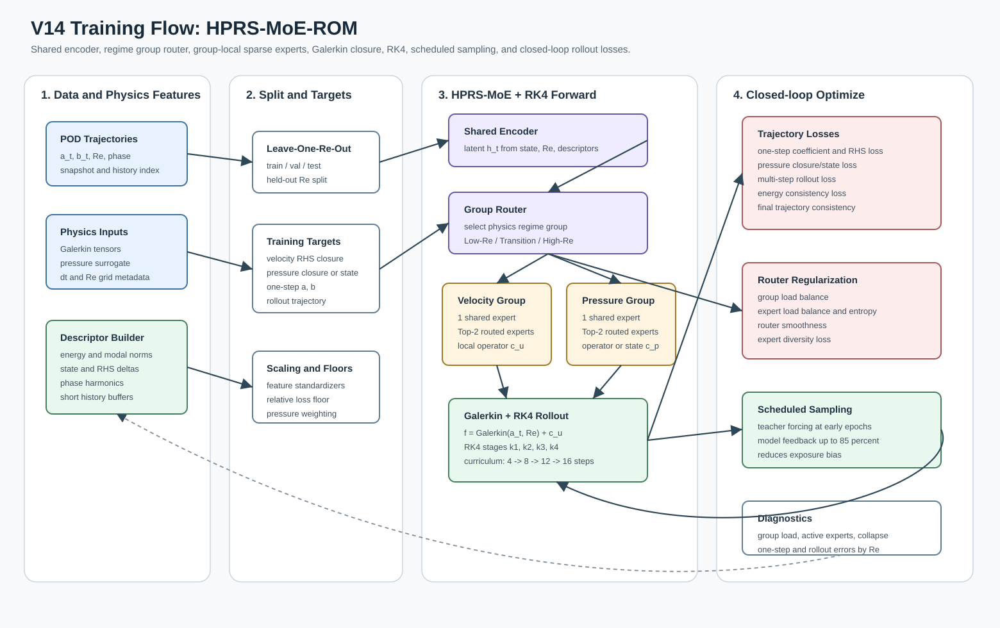
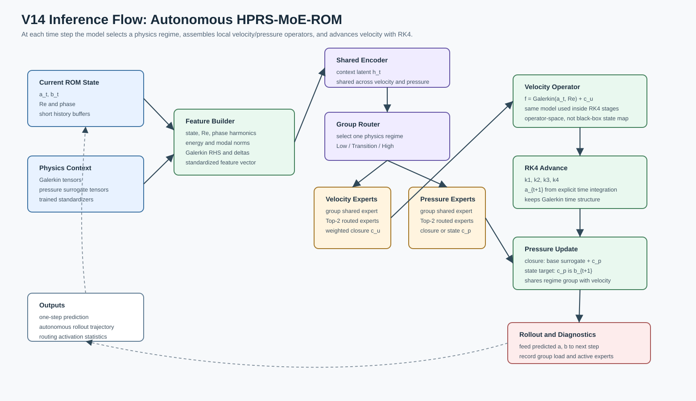

# V14 技术报告：HPRS-MoE-ROM

日期：2026-07-01

代码：`test_results_v14/train_v14.py`

数据：`/root/moe/V8/data/Global_POD_Weighted_L2`

主实验：`v14_r16_hprs_closure_3g6e_closed_loop`

## 1. 目标与结论

V14 不继续简单增加专家数或隐藏层规模，而是在 V13 的
`Shared Encoder + Physics-aware Experts + Galerkin + RK4` 主干上，
升级为完整的 Hierarchical Physics-Regime Sparse Mixture of Experts
（HPRS-MoE）框架。

核心目标：

- 用 Group Router 先选择 Low-Re / Transition / High-Re 等 physics regime；
- 每个 regime group 内使用 1 个 group-shared expert 和若干 routed experts；
- velocity 和 pressure 共享 regime group router，但保留各自 group-local Top-2 router；
- expert 继续输出 ROM operator / closure，不改成黑盒下一步状态预测；
- 保留 Galerkin 物理底座和 RK4 显式时间推进；
- 把训练重点从单步监督转向 closed-loop rollout dynamics；
- 在推理阶段统计 group/expert 激活个数、使用分布和 collapse 风险。

主实验结论：

- HPRS group router 在三个 held-out Re 上学到了清晰 regime 划分：
  low Re -> group 0，mid Re -> group 1，high Re -> group 2。
- Re=120 的 one-step 和 autonomous rollout 速度/压力全部低于 10%。
- Re=300 的 one-step 速度/压力低于 10%，但 24-step autonomous rollout 仍有 21%-23% drift。
- Re=56.3745 的 closure-pressure 主实验仍未解决压力误差，one-step pressure 约 29.7%。
- low-Re `pressure-target=state` 定向实验在训练 validation 上能把 pressure 降到约 1.3%，
  但 held-out low-Re test pressure 仍约 29.0%，说明该问题不是简单改 state target 就能解决。
- low-Re state-pressure 定向实验仍有价值：velocity rollout 从 26.6% 降到 14.5%，pressure rollout
  从 49.5% 降到 41.3%，但距离 10% 目标仍有明显差距。
- 专家 operator diversity 未出现整体 collapse；当前 test split 内 dead expert 数偏高主要来自
  hard group routing 后单个 held-out Re 只激活一个 group，符合分层 regime 设计预期。

## 2. 参考的 MoE 设计思想

V14 的架构借鉴了大模型 MoE 中几个稳定经验，但做了 ROM/物理动力学适配：

- Switch Transformer 使用稀疏激活思想，用 routing 为不同输入选择不同参数子集，控制计算成本。
  参考：<https://arxiv.org/abs/2101.03961>
- Mixtral 使用 Top-2 sparse experts，让每个 token 只经过两个专家但保留组合表达能力。
  参考：<https://arxiv.org/abs/2401.04088>
- DeepSeekMoE 显式引入 shared experts 捕获通用知识，同时让 routed experts 更专门化。
  参考：<https://arxiv.org/abs/2401.06066>

V14 的不同点是：router 不按语言 token 选 FFN，而是按 POD state、Re、history 和物理描述符选择
局部 ROM 动力学算子；expert 输出被送入 Galerkin/RK4 时间推进，而不是直接输出下一步状态。

## 3. 模型训练与推理框架图

训练流程图：



推理流程图：



源图文件：

- `docs/v14_training_flow.mmd`
- `docs/v14_inference_flow.mmd`
- `docs/v14_training_flow.svg`
- `docs/v14_inference_flow.svg`

## 4. 模型结构

输入特征：

```text
x_t = [a_t, b_t, Re, phase, physical descriptors, history]
```

其中 physical descriptors 包含能量、速度/压力模态范数、Galerkin RHS 范数、历史状态差分、
历史 RHS 差分、phase harmonics 等。

HPRS-MoE forward：

```text
x_t
  -> shared encoder h_t
  -> group router pi_g(h_t, x_t)
  -> selected physics regime group g
       -> velocity group:
            group shared expert
            group-local Top-2 routed velocity experts
       -> pressure group:
            group shared expert
            group-local Top-2 routed pressure experts
  -> weighted local operators c_u, c_p
  -> f_u = Galerkin(a_t, Re) + c_u
  -> RK4(f_u) -> a_{t+1}
  -> pressure closure/state -> b_{t+1}
```

默认主配置：

| item | value |
|---|---:|
| velocity POD rank `r_u` | 16 |
| pressure POD rank `r_p` | 16 |
| regime groups | 3 |
| routed experts per group | 6 |
| group-shared experts per group | 1 |
| in-group top-k | 2 |
| group top-k | 1 |
| hidden dim | 224 |
| expert hidden dim | 768 |
| expert blocks | 3 |
| quadratic rank | 4 |
| integrator | RK4 |

每个 expert 的结构仍是 physics-aware operator block：

```text
expert(state, h)
  = linear(state)
  + low_rank_quadratic(state)
  + residual_FFN([state, h])
```

这使 expert 的语义从 V10/V13 的“误差补丁/全局专家池”进一步变成“某个 physics regime 内的局部动力学算子”。

## 5. Closed-loop 训练策略

V14 的关键改动在训练策略，而不是参数量。

训练 loss 包括：

- one-step coefficient loss；
- full RHS/operator loss；
- pressure closure/state loss；
- relative loss with floor，避免低幅值样本完全主导；
- multi-step rollout loss；
- energy / dissipation consistency loss；
- final trajectory consistency loss；
- group router load-balance、entropy、weak Re-regime supervision；
- in-group router load-balance、entropy、smoothness；
- expert diversity regularization。

闭环 rollout curriculum：

```text
4 steps -> 8 steps -> 12 steps -> 16 steps
```

Scheduled sampling：

```text
teacher forcing ratio high at early epochs
model-feedback probability gradually increases to 0.85
```

这样训练时逐步让模型使用自己的预测作为下一步输入，减轻长期 autonomous rollout 时的 exposure bias。

## 6. 运行脚本

| 脚本 | 用途 |
|---|---|
| `test_results_v14/run_v14_hprs_smoke.sh` | 2 epoch smoke test |
| `test_results_v14/run_v14_hprs_closed_loop.sh` | closure-pressure HPRS 主实验 |
| `test_results_v14/run_v14_hprs_state_pressure.sh` | all-Re pressure state 对照 |
| `test_results_v14/run_v14_hprs_lowre_pressure.sh` | low-Re closure-pressure 加权对照 |
| `test_results_v14/run_v14_hprs_lowre_state_pressure.sh` | low-Re pressure-state 定向实验 |

主实验使用 `pressure-target=closure`；低 Re 定向实验使用 `pressure-target=state` 并提高 pressure/trajectory loss 权重。

## 7. 主实验结果

Experiment: `v14_r16_hprs_closure_3g6e_closed_loop`

Runtime: `15.02 h`

| Held-out Re | Best epoch | RHS L2 | Alpha head L2 | Pressure head L2 | One-step a | One-step b | Rollout a | Rollout b |
|---:|---:|---:|---:|---:|---:|---:|---:|---:|
| 56.3745 | 110 | 0.123469 | 0.296690 | 0.294127 | 0.056321 | 0.297137 | 0.265512 | 0.495149 |
| 120.0 | 170 | 0.111732 | 0.200608 | 0.008472 | 0.018418 | 0.024380 | 0.051230 | 0.050081 |
| 300.0 | 155 | 0.070708 | 0.256384 | 0.045115 | 0.034579 | 0.053887 | 0.216845 | 0.232747 |

这里的 one-step 指 autonomous one-step，即用模型推进一步后的 `a_{t+1}, b_{t+1}` relative L2。
rollout 指 autonomous rollout 窗口均值，不是 teacher-forced 结果。

达到 10% 的部分：

- Re=120：one-step 和 rollout 的速度/压力都低于 10%；
- Re=300：one-step 速度/压力低于 10%。

未达到 10% 的部分：

- Re=56.3745：pressure one-step 与 rollout 仍较高；
- Re=300：长期 rollout drift 仍较高，约 21%-23%；
- Re=56.3745 与 Re=300 的长期 autonomous 稳定性仍是 V14 后续核心问题。

## 8. Routing 与 Expert 诊断

V14 在训练结束后的 metrics JSON 中同时保存 train/test 激活统计：

- `routing_analysis_train` / `routing_analysis_test`：velocity 和 pressure 合并后的 expert load、
  top1 fraction、active experts/sample、dead slots、phase-bin 分布；
- `group_routing_analysis_train` / `group_routing_analysis_test`：regime group load、top1 fraction、
  active groups、按 low/mid/high Re 分组的使用情况；
- `routing_by_re_group_train`：训练集上低/中/高 Re 的 expert 使用分布；
- `shared_operator_analysis_train` / `shared_operator_analysis_test`：group-shared expert 使用情况；
- `expert_operator_diversity`：expert operator pairwise cosine 与 collapse flag；
- `expert_error_analysis_test`：各 expert 对 test split 的 one-step / rollout 误差统计。

每 5 epoch 的训练日志默认只打印 compact validation error，避免日志过大；代码中已提供
`--eval-routing-every` 可选开关，开启后可在训练验证阶段同步输出轻量 routing 摘要。

| Held-out Re | Group load | Active experts/sample | Dead expert slots | Load CV | Max abs expert cosine | Collapse |
|---:|---|---:|---:|---:|---:|---|
| 56.3745 | `[1.000, 0.000, 0.000]` | 4.000 | 17 | 2.609 | 0.867166 | false |
| 120.0 | `[0.000, 1.000, 0.000]` | 3.984 | 17 | 2.626 | 0.716826 | false |
| 300.0 | `[0.000, 0.000, 1.000]` | 4.214 | 16 | 2.556 | 0.523755 | false |

解释：

- group router cleanly separates three held-out regimes；
- 每个 held-out Re 测试集只落入一个 group，所以全局 expert slot 统计中会出现较多 dead slots；
- 这不等于所有专家整体塌缩，而是分层稀疏激活的直接结果；
- expert cosine 最大值均低于 0.95，未触发 collapse flag；
- active experts/sample 接近 4，是 group-shared expert + Top-2 routed experts 在 velocity/pressure 两个分支上的合并统计。

## 9. Low-Re state-pressure 定向实验

Experiment: `v14_r16_hprs_lowre_state_pressure`

目的：

- 验证低 Re pressure 是否主要受 closure target / pressure surrogate 残差建模限制；
- 将 pressure target 改为 state，增强 pressure loss 与 pressure rollout loss；
- 只测试 held-out Re=56.3745。

结果：

Runtime: `5.40 h`

| Held-out Re | Best epoch | RHS L2 | Alpha head L2 | Pressure head L2 | One-step a | One-step b | Rollout a | Rollout b |
|---:|---:|---:|---:|---:|---:|---:|---:|---:|
| 56.3745 | 180 | 0.125788 | 0.305206 | 0.290321 | 0.047609 | 0.290321 | 0.144923 | 0.413418 |

与 closure-pressure 主实验对比：

| Metric | Closure main | Low-Re state-pressure | Change |
|---|---:|---:|---:|
| One-step velocity `a` | 0.056321 | 0.047609 | improved |
| One-step pressure `b` | 0.297137 | 0.290321 | slight improved |
| Rollout velocity `a` | 0.265512 | 0.144923 | improved |
| Rollout pressure `b` | 0.495149 | 0.413418 | improved |

诊断：

- 训练/validation pressure 曾降到约 1.3%，但 held-out low-Re test pressure 仍约 29.0%；
- 这说明 pressure-state target 对 seen-Re validation 有效，但跨 Re 泛化仍受限制；
- 该实验改善了 low-Re rollout drift，尤其 velocity rollout，但仍没有达到 10% 目标；
- group router 仍将该 held-out Re 全部分配到 group 0，符合 Low-Re regime 语义；
- expert diversity 最大绝对 cosine 为 0.768529，未触发 collapse。

## 10. GPU 利用率诊断

用户观察到训练时 GPU 利用率约 16%。训练期间检查远端状态为：

- 训练 bash 进程仍在运行，当时不是最终推理阶段；
- Python 子进程为 `train_v14.py`，不是最终推理阶段；
- 最后日志为 epoch 165，说明仍处于 closed-loop training；
- GPU 利用率短采样约 15%-20%；
- 显存占用约 1.6 GB；
- PyTorch autograd CPU 线程约 94% CPU。

原因判断：

- ROM rank 只有 16，矩阵计算规模很小；
- RK4 每一步会触发多次模型 RHS 评估，但每次 kernel 都很小；
- hierarchical sparse MoE 里 group mask / in-group Top-2 / expert selection 有较多 Python 控制流；
- rollout batch 设置为 2，利于稳定训练但不利于 GPU 吞吐；
- validation 和 diagnostics 包含较多 CPU 侧统计。

因此低 GPU 利用率不是训练停止或进入最终推理，而是小规模物理 ROM + 稀疏路由 + 多步闭环训练的典型吞吐形态。
考虑用户明确“不在乎训练时间”，本次没有中断实验去改 batch 或 vectorization，以避免影响当前结果可比性。

## 11. 与 V13 的关系

V13 使用 flat expert pool + shared experts：

```text
shared encoder -> velocity router / pressure router -> global Top-2 experts + shared experts
```

V14 改为 hierarchical regime experts：

```text
shared encoder -> group router -> selected regime group -> in-group Top-2 routed experts + group-shared expert
```

改动收益：

- expert 语义更清晰：从全局专家竞争变为 regime 内局部动力学算子；
- group router 在 Low/Mid/High Re 上产生可解释分工；
- 中 Re rollout 显著稳定，达到速度和压力都低于 10%；
- shared expert 从 V13 的全局共享改成 group-local 共享，更符合“通用 regime 知识 + 局部专家差异”的结构。

仍未解决：

- low-Re pressure 在 closure target 下仍高；
- high-Re 长期 rollout drift 仍未低于 10%；
- 当前 sparse group 实现为了保持语义可解释，牺牲了一部分 GPU 吞吐效率。

## 12. 后续建议

最有价值的下一步不是继续增大专家数，而是：

- 为 high-Re rollout 增加 stability-aware loss，例如 spectral radius / Jacobian norm 约束；
- 对 low-Re pressure 使用 state-pressure target 或 pressure-specific local surrogate；
- 将 rollout loss 按 Re 分组自适应加权，让 high-Re drift 直接进入 early stopping score；
- 对 HPRS 做更彻底的 vectorized grouped expert execution，提升 GPU 利用率；
- 在推理阶段记录连续时间的 group switching 频率，检查是否存在 regime 抖动；
- 做 leave-neighborhood-out，而不仅是 leave-one-Re-out，验证跨 Re 外推稳定性。

## 13. 文件与 checkpoint

GitHub 产物包含源码、脚本、报告、框架图、metrics JSON 和 summary markdown。

大 checkpoint 文件保留在集群，不直接推 GitHub：

```text
/root/moe/V14/test_results_v14/results/*/*checkpoint.pt
```

原因是 checkpoint 文件大，不适合直接进入 GitHub 普通仓库历史。
