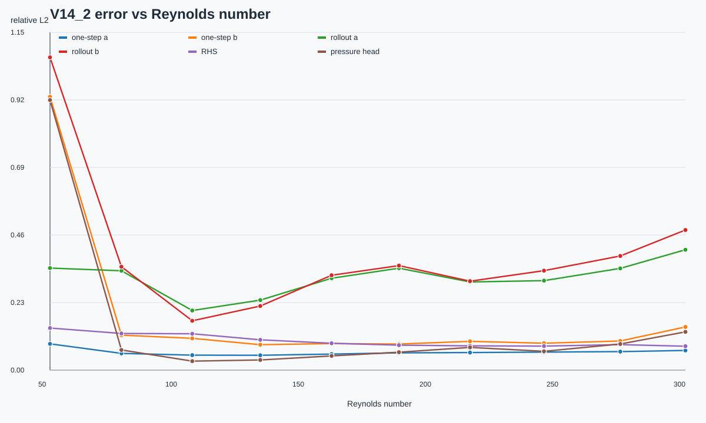
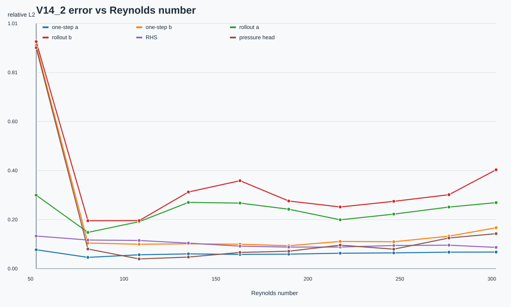

# V14_2 技术报告：DataAblation for HPRS-MoE-ROM

日期：2026-07-02

代码：`test_results_v14_2/train_v14_2.py`

基线：`V14/TECHNICAL_REPORT_V14.md`

## 1. 实验目标

V14_2 不修改 HPRS-MoE、Galerkin、RK4、Loss、Router、Expert、主要超参数和训练流程，
只修改数据划分方式，用来验证当前训练数据组织是否限制了跨 Re 泛化能力。

核心问题：

- 连续时间步样本高度相关，是否导致模型过度依赖时间冗余；
- 减少每个训练 Re 的时间样本密度，是否降低过拟合；
- 进一步减少训练 Re 密度，是否暴露参数空间覆盖不足；
- Low-Re pressure 和 High-Re rollout drift 的瓶颈来自数据组织还是模型结构。

## 2. 保持不变的部分

与 V14 完全保持一致：

- Shared Encoder + HPRS-MoE group router；
- 每个 group 内 1 个 shared expert + Top-2 routed experts；
- Physics-aware expert block：Linear + Low-rank Quadratic + Residual FFN；
- Galerkin RHS + learned closure + RK4；
- one-step、RHS、pressure、multi-step rollout、energy、trajectory consistency、router、diversity losses；
- scheduled sampling、4/8/12/16 rollout curriculum；
- r_u=16、r_p=16、3 groups、6 routed experts/group、hidden=224、expert_hidden=768；
- 24-step autonomous rollout evaluation。

V14_2 只改变训练/测试数据组织。

## 3. 数据划分设计

测试 Re 不再只使用 V14 的 `56.3745 / 120 / 300`，而是在 Re=50-300 上均匀选择 10 个 held-out Re：

```text
50.0, 78.0906, 105.983, 132.743, 160.785,
187.285, 215.256, 244.354, 274.377, 300.0
```

这些 Re 完全不参与训练。每个 ablation 只训练一个模型，然后评估全部 10 个 held-out Re。

| Test | 数据策略 | Train Re | Test Re | Dense train | Kept train | Val | Test | 压缩比 |
|---|---|---:|---:|---:|---:|---:|---:|---:|
| Test1 | 每个训练 Re 每 5 个时间步保留 1 个 one-step 样本 | 90 | 10 | 9964 | 2044 | 1350 | 1255 | 0.2051 |
| Test2 | Test1 + 每 2 个非测试 Re 保留 1 个训练 Re | 45 | 10 | 4983 | 1023 | 675 | 1255 | 0.2053 |

实现细节：

- one-step batch 使用稀疏时间样本；
- rollout loss 仍使用稀疏训练起点，但沿该训练 Re 的连续真实轨迹监督 16 步；
- 因此 closed-loop RK4 rollout training 没有因为时间稀疏而被关闭；
- final evaluation 对每个 held-out Re 计算 RHS、one-step velocity/pressure、24-step autonomous rollout velocity/pressure、routing、diversity。

## 4. GPU 与监控

V14 单进程训练 GPU 利用率常在 15%-20%。V14_2 做了两点不改变模型/超参的处理：

- 启用 TF32 matmul/cudnn；
- Test1 和 Test2 并行运行两个小 ROM 训练进程。

启动检查时 GPU 利用率短采样达到 93%-99%，显著高于 V14 单进程。后期只剩单个进程或进入最终评估时 GPU 会降到较低水平，这是正常的。

监控方式：

- 不实时刷完整日志；
- 每 10-30 分钟只读取进程状态、GPU 一行、最后一条 `epoch_eval` 和 metrics 是否生成；
- 训练完成后才拉取 metrics、summary、error-vs-Re 图。

## 5. Test1：时间稀疏采样

Experiment: `v14_2_test1_time_sparse_s5_uniform10`

Runtime: `1.374 h`

误差随 Re 变化曲线：



| Re | RHS | Pressure head | One-step a | One-step b | Rollout a | Rollout b | Group load |
|---:|---:|---:|---:|---:|---:|---:|---|
| 50.0 | 0.1428 | 0.9171 | 0.0892 | 0.9282 | 0.3466 | 1.0621 | `[1.000,0.000,0.000]` |
| 78.0906 | 0.1244 | 0.0684 | 0.0570 | 0.1187 | 0.3374 | 0.3510 | `[0.532,0.468,0.000]` |
| 105.983 | 0.1235 | 0.0306 | 0.0508 | 0.1079 | 0.2025 | 0.1676 | `[0.000,1.000,0.000]` |
| 132.743 | 0.1028 | 0.0345 | 0.0504 | 0.0864 | 0.2379 | 0.2177 | `[0.000,1.000,0.000]` |
| 160.785 | 0.0913 | 0.0483 | 0.0544 | 0.0902 | 0.3120 | 0.3222 | `[0.000,0.392,0.608]` |
| 187.285 | 0.0848 | 0.0608 | 0.0587 | 0.0886 | 0.3462 | 0.3549 | `[0.000,0.032,0.968]` |
| 215.256 | 0.0825 | 0.0772 | 0.0597 | 0.0978 | 0.2994 | 0.3021 | `[0.000,0.016,0.984]` |
| 244.354 | 0.0816 | 0.0639 | 0.0612 | 0.0913 | 0.3038 | 0.3378 | `[0.000,0.032,0.968]` |
| 274.377 | 0.0866 | 0.0888 | 0.0628 | 0.0989 | 0.3455 | 0.3875 | `[0.000,0.024,0.976]` |
| 300.0 | 0.0811 | 0.1298 | 0.0669 | 0.1466 | 0.4087 | 0.4757 | `[0.000,0.040,0.960]` |

Aggregate:

| Metric | mean | std | min | max |
|---|---:|---:|---:|---:|
| RHS | 0.1002 | 0.0212 | 0.0811 | 0.1428 |
| Pressure head | 0.1519 | 0.2565 | 0.0306 | 0.9171 |
| One-step a | 0.0611 | 0.0106 | 0.0504 | 0.0892 |
| One-step b | 0.1855 | 0.2482 | 0.0864 | 0.9282 |
| Rollout a | 0.3140 | 0.0558 | 0.2025 | 0.4087 |
| Rollout b | 0.3979 | 0.2357 | 0.1676 | 1.0621 |

观察：

- 时间稀疏训练没有改善 rollout drift，rollout a/b 均值明显高；
- Re=50 pressure 完全失效，one-step b 约 92.8%，rollout b 超过 100%；
- Re=300 rollout a/b 为 40.9%/47.6%，比 V14 高 Re drift 更差；
- 中间 Re 的 one-step velocity 基本低于 10%，但 pressure 和 rollout 稳定性不够。

## 6. Test2：时间稀疏 + Re 稀疏

Experiment: `v14_2_test2_time_s5_re_s2_uniform10`

Runtime: `1.056 h`

误差随 Re 变化曲线：



| Re | RHS | Pressure head | One-step a | One-step b | Rollout a | Rollout b | Group load |
|---:|---:|---:|---:|---:|---:|---:|---|
| 50.0 | 0.1338 | 0.9071 | 0.0775 | 0.9164 | 0.3017 | 0.9324 | `[1.000,0.000,0.000]` |
| 78.0906 | 0.1175 | 0.0805 | 0.0462 | 0.1050 | 0.1488 | 0.1967 | `[0.508,0.492,0.000]` |
| 105.983 | 0.1155 | 0.0398 | 0.0570 | 0.1001 | 0.1929 | 0.1971 | `[0.000,1.000,0.000]` |
| 132.743 | 0.1046 | 0.0475 | 0.0606 | 0.1020 | 0.2720 | 0.3147 | `[0.000,0.928,0.072]` |
| 160.785 | 0.0923 | 0.0665 | 0.0583 | 0.1001 | 0.2691 | 0.3611 | `[0.024,0.344,0.632]` |
| 187.285 | 0.0884 | 0.0715 | 0.0595 | 0.0940 | 0.2440 | 0.2778 | `[0.016,0.103,0.881]` |
| 215.256 | 0.0886 | 0.0965 | 0.0632 | 0.1118 | 0.2005 | 0.2532 | `[0.032,0.071,0.897]` |
| 244.354 | 0.0950 | 0.0798 | 0.0647 | 0.1103 | 0.2238 | 0.2763 | `[0.032,0.088,0.880]` |
| 274.377 | 0.0964 | 0.1259 | 0.0676 | 0.1335 | 0.2529 | 0.3036 | `[0.000,0.104,0.896]` |
| 300.0 | 0.0872 | 0.1436 | 0.0682 | 0.1679 | 0.2710 | 0.4061 | `[0.008,0.063,0.929]` |

Aggregate:

| Metric | mean | std | min | max |
|---|---:|---:|---:|---:|
| RHS | 0.1019 | 0.0148 | 0.0872 | 0.1338 |
| Pressure head | 0.1659 | 0.2489 | 0.0398 | 0.9071 |
| One-step a | 0.0623 | 0.0078 | 0.0462 | 0.0775 |
| One-step b | 0.1941 | 0.2416 | 0.0940 | 0.9164 |
| Rollout a | 0.2377 | 0.0437 | 0.1488 | 0.3017 |
| Rollout b | 0.3519 | 0.2031 | 0.1967 | 0.9324 |

观察：

- Test2 比 Test1 的 rollout 均值更好：rollout a `0.3140 -> 0.2377`，rollout b `0.3979 -> 0.3519`；
- Re 稀疏可能降低了一部分时间冗余带来的过拟合，但收益有限；
- Re=50 pressure 仍严重失效，说明 Low-Re pressure 不是简单时间样本冗余问题；
- Re=300 rollout 有所改善，但仍为 a=27.1%、b=40.6%，没有达到长期稳定积分目标。

## 7. 与 V14 对比

V14 主实验只测试 3 个点，因此与 V14_2 的 10-Re aggregate 不是严格同分布对比。仍可观察趋势：

| Experiment | Test Re | One-step a mean | One-step b mean | Rollout a mean | Rollout b mean |
|---|---:|---:|---:|---:|---:|
| V14 main | 3 | 0.0364 | 0.1251 | 0.1779 | 0.2593 |
| V14_2 Test1 | 10 | 0.0611 | 0.1855 | 0.3140 | 0.3979 |
| V14_2 Test2 | 10 | 0.0623 | 0.1941 | 0.2377 | 0.3519 |

可直接比较的 Re=300：

| Experiment | One-step a | One-step b | Rollout a | Rollout b |
|---|---:|---:|---:|---:|
| V14 main | 0.0346 | 0.0539 | 0.2168 | 0.2327 |
| V14_2 Test1 | 0.0669 | 0.1466 | 0.4087 | 0.4757 |
| V14_2 Test2 | 0.0682 | 0.1679 | 0.2710 | 0.4061 |

结论：

- 时间稀疏没有改善 V14 的泛化，反而降低 one-step 和 rollout 表现；
- Re 稀疏让 rollout a 有一定改善，但 pressure rollout 仍明显偏高；
- 更大的测试集揭示出 V14 在 Re=120 的成功不是全参数空间普遍现象；
- 低 Re 极端点 Re=50 的 pressure 是最明显失败点；
- 高 Re rollout drift 仍存在，特别是 pressure。

## 8. Router 行为

V14_2 的 group router 仍能学到大致 regime 划分：

- Re=50 全部进入 group 0；
- Re≈105-133 主要进入 group 1；
- Re≥187 大部分进入 group 2；
- 过渡区 Re≈78、160 出现 group 混合，这比 V14 三点测试更能显示 regime boundary。

这说明 router 语义基本成立，主要瓶颈不是 group router 完全失效，而是 pressure operator 与长期闭环稳定性不足。

## 9. 瓶颈判断

基于 V14_2 的结果，我的判断是：

- 当前训练数据的连续时间冗余确实存在，稀疏后训练时间显著下降；
- 但减少时间样本密度没有改善跨 Re 泛化，说明冗余时间样本不是主要瓶颈；
- Re 稀疏带来少量 rollout 改善，提示训练 Re 分布与参数空间覆盖方式会影响长期稳定性；
- Low-Re pressure 尤其 Re=50 的失败非常严重，更像 pressure surrogate/pressure branch/物理约束不足；
- High-Re rollout drift 仍然明显，更像长期动力学稳定性约束不足，而不是单纯数据划分问题。

因此，V14 的核心瓶颈仍偏向模型/物理约束与 pressure operator 泛化，而不是“连续时间样本太密”这一单一数据组织问题。

## 10. 后续建议

优先方向：

- 为 pressure branch 增加 pressure-specific physics loss，例如 Poisson residual 或 pressure algebraic consistency；
- 对 low-Re 做局部 pressure surrogate/anchor，而不是只靠全局 closure；
- 对 high-Re 增加 stability-aware rollout loss，例如 energy envelope、Jacobian/spectral radius 或 Lyapunov-style drift penalty；
- 保留全 Re 10-point evaluation 作为后续版本的标准测试集；
- 训练时继续采用并行小 ROM 进程或更彻底的 grouped expert vectorization，以提高 GPU 利用率。

## 11. 文件

主要结果文件：

- `test_results_v14_2/results/v14_2_test1_time_sparse_s5_uniform10/v14_2_test1_time_sparse_s5_uniform10_metrics.json`
- `test_results_v14_2/results/v14_2_test1_time_sparse_s5_uniform10/v14_2_test1_time_sparse_s5_uniform10_error_vs_re.svg`
- `test_results_v14_2/results/v14_2_test2_time_s5_re_s2_uniform10/v14_2_test2_time_s5_re_s2_uniform10_metrics.json`
- `test_results_v14_2/results/v14_2_test2_time_s5_re_s2_uniform10/v14_2_test2_time_s5_re_s2_uniform10_error_vs_re.svg`

Checkpoint 文件保留在集群，不提交 GitHub。
