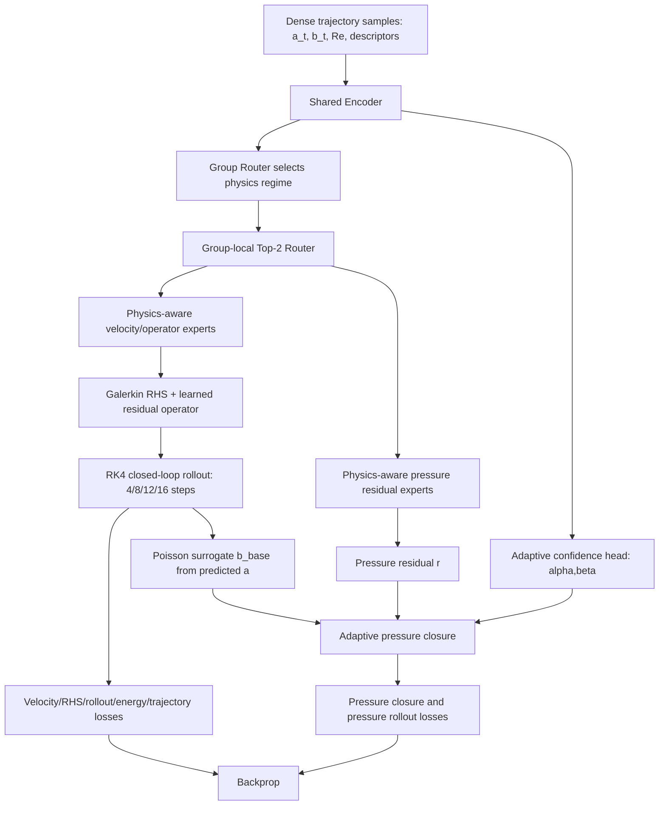

# V14_AdaptivePressureClosure 实验报告

生成日期：2026-07-04
分支：`codex/v14-adaptive-pressure-closure`
实验目录：`V14_AdaptivePressureClosure/test_results_adaptive_pressure_closure`
SwanLab 项目：<https://swanlab.cn/@panxy1019/V14_AdaptivePressureClosure>

## 1. 实验目标

本实验在当前 V14/V14_3 HPRS-MoE 框架上只验证 Pressure Closure 的融合方式是否是低 Re 压力泛化失败的关键瓶颈。模型主干保持不变：Shared Encoder、Group Router、Group 内 Top-2 Router、Velocity Head、Pressure Head、Physics-aware Experts、Galerkin RHS、RK4 积分、Loss、Poisson Surrogate、dense 数据划分、超参数和训练流程都不改变。

对比对象包括：

- Baseline：`b_pred = b_base + r`，即 V14_3 当前 closure 形式。
- Adaptive Residual Scaling：`b_pred = b_base + alpha(x) * r`。
- Adaptive Base Scaling：`b_pred = alpha(x) * b_base + r`。
- Dual Adaptive Closure：`b_pred = (1 + beta(x)) * b_base + alpha(x) * r`。

其中 `alpha in [0, 1]`，`beta in [-0.5, 0.5]`，由一个两层 MLP confidence head 从已有 encoder latent `h` 预测，不重新编码原始输入，也不影响 Router。

## 2. 训练与推理流程

### 训练流程图



### 推理与最终评估流程图

```mermaid
flowchart TD
    A0[Initial state a_t, b_t, Re, history] --> B0[Shared Encoder + HPRS-MoE routers]
    B0 --> C0[Weighted local ROM operator]
    C0 --> D0[RK4 integrate a_{t+1}]
    D0 --> E0[Poisson surrogate b_base(a_{t+1}, Re)]
    B0 --> F0[Pressure residual r]
    B0 --> G0[Confidence alpha,beta]
    E0 --> H0[Closure: Baseline / ResidualScaling / BaseScaling / Dual]
    F0 --> H0
    G0 --> H0
    H0 --> I0[Predicted b_{t+1}]
    D0 --> J0[Autonomous 24-step rollout]
    I0 --> J0
    J0 --> K0[Metrics: one-step, RHS, 24-step velocity/pressure, pressure energy]
```

## 3. 数据与训练设置

- Held-out Re：`50.0, 78.0906, 105.983, 132.743, 160.785, 187.285, 215.256, 244.354, 274.377, 300.0`。
- 训练 Re 数量：90。
- 测试 Re 数量：10。
- 训练样本：9964。
- 验证样本：1350。
- 测试样本：1255。
- 训练数据组织：V14 dense time sampling，`train_time_stride=1`，`train_re_stride=1`。
- 训练 rollout curriculum：`4 -> 8 -> 12 -> 16` steps。
- 最终评估 rollout：24-step autonomous rollout。
- 三个 adaptive case 并行运行在单张 NVIDIA A40 上，单个 case 约 9.13-9.39 小时。

## 4. 总体结果

| Mode | Best epoch | 1-step u | 1-step p | 24-step u | 24-step p | RHS | p-energy rollout | alpha | beta |
|---|---:|---:|---:|---:|---:|---:|---:|---:|---:|
| Baseline b_base + r | 200 | 0.02300 | 0.12113 | 0.07318 | 0.16416 | 0.09257 | 0.07213 | - | - |
| Adaptive Residual Scaling | 195 | 0.02390 | 0.11799 | 0.09451 | 0.18282 | 0.09186 | 0.06309 | 0.98269 | 0.00000 |
| Adaptive Base Scaling | 180 | 0.02644 | 0.11664 | 0.09320 | 0.20036 | 0.09284 | 0.06265 | 0.97930 | 0.00000 |
| Dual Adaptive Closure | 180 | 0.02402 | 0.11964 | 0.08592 | 0.18316 | 0.09341 | 0.09396 | 0.95443 | -0.02689 |

### 相对 Baseline 的变化

正数表示误差降低，负数表示误差升高。

| Mode | 1-step p vs baseline | 24-step p vs baseline | p-energy rollout vs baseline | 24-step u vs baseline |
|---|---:|---:|---:|---:|
| Adaptive Residual Scaling | +2.59% | -11.37% | +12.53% | -29.14% |
| Adaptive Base Scaling | +3.71% | -22.05% | +13.14% | -27.36% |
| Dual Adaptive Closure | +1.23% | -11.57% | -30.26% | -17.40% |

## 5. Mean / Std / Min / Max

| Mode | Metric | Mean | Std | Min | Max |
|---|---|---:|---:|---:|---:|
| Baseline b_base + r | 1-step velocity | 0.02300 | 0.01612 | 0.00926 | 0.06624 |
| Baseline b_base + r | 1-step pressure | 0.12113 | 0.28336 | 0.01530 | 0.97020 |
| Baseline b_base + r | 24-step rollout velocity | 0.07318 | 0.07860 | 0.02679 | 0.30294 |
| Baseline b_base + r | 24-step rollout pressure | 0.16416 | 0.33240 | 0.02986 | 1.1591 |
| Baseline b_base + r | RHS | 0.09257 | 0.01825 | 0.07077 | 0.12091 |
| Baseline b_base + r | rollout pressure energy | 0.07213 | 0.12357 | 0.00055 | 0.43255 |
| Adaptive Residual Scaling | 1-step velocity | 0.02390 | 0.01436 | 0.01585 | 0.06557 |
| Adaptive Residual Scaling | 1-step pressure | 0.11799 | 0.27530 | 0.01748 | 0.94336 |
| Adaptive Residual Scaling | 24-step rollout velocity | 0.09451 | 0.12388 | 0.03229 | 0.46152 |
| Adaptive Residual Scaling | 24-step rollout pressure | 0.18282 | 0.35467 | 0.03582 | 1.2430 |
| Adaptive Residual Scaling | RHS | 0.09186 | 0.01770 | 0.07044 | 0.12112 |
| Adaptive Residual Scaling | rollout pressure energy | 0.06309 | 0.10368 | 0.00242 | 0.36380 |
| Adaptive Base Scaling | 1-step velocity | 0.02644 | 0.01410 | 0.01610 | 0.06546 |
| Adaptive Base Scaling | 1-step pressure | 0.11664 | 0.25925 | 0.01903 | 0.89351 |
| Adaptive Base Scaling | 24-step rollout velocity | 0.09320 | 0.08299 | 0.04267 | 0.32782 |
| Adaptive Base Scaling | 24-step rollout pressure | 0.20036 | 0.37459 | 0.04928 | 1.3198 |
| Adaptive Base Scaling | RHS | 0.09284 | 0.01887 | 0.07031 | 0.12259 |
| Adaptive Base Scaling | rollout pressure energy | 0.06265 | 0.09046 | 0.00001 | 0.30325 |
| Dual Adaptive Closure | 1-step velocity | 0.02402 | 0.01407 | 0.01292 | 0.06273 |
| Dual Adaptive Closure | 1-step pressure | 0.11964 | 0.27514 | 0.01573 | 0.94413 |
| Dual Adaptive Closure | 24-step rollout velocity | 0.08592 | 0.04908 | 0.03736 | 0.20530 |
| Dual Adaptive Closure | 24-step rollout pressure | 0.18316 | 0.28724 | 0.04208 | 1.0395 |
| Dual Adaptive Closure | RHS | 0.09341 | 0.01973 | 0.06982 | 0.12135 |
| Dual Adaptive Closure | rollout pressure energy | 0.09396 | 0.16445 | 0.00074 | 0.57481 |

## 6. 按 Re 区间分析

| Group | Mode | 1-step p | 24-step p | 24-step u | alpha | beta | base contrib | residual contrib |
|---|---|---:|---:|---:|---:|---:|---:|---:|
| Low Re (<100): 50, 78.09 | Baseline b_base + r | 0.51317 | 0.61939 | 0.18910 | - | - | - | - |
| Low Re (<100): 50, 78.09 | Adaptive Residual Scaling | 0.49204 | 0.65619 | 0.26019 | 0.93572 | 0.00000 | 1.6580 | 1.3333 |
| Low Re (<100): 50, 78.09 | Adaptive Base Scaling | 0.47501 | 0.72485 | 0.22050 | 0.89809 | 0.00000 | 1.4778 | 1.1921 |
| Low Re (<100): 50, 78.09 | Dual Adaptive Closure | 0.49960 | 0.58860 | 0.16530 | 0.81414 | -0.13911 | 1.4211 | 1.1357 |
| Mid Re (100-244): 105.98-215.26 | Baseline b_base + r | 0.01776 | 0.04437 | 0.03922 | - | - | - | - |
| Mid Re (100-244): 105.98-215.26 | Adaptive Residual Scaling | 0.02097 | 0.04871 | 0.04314 | 0.99387 | 0.00000 | 0.95721 | 0.36056 |
| Mid Re (100-244): 105.98-215.26 | Adaptive Base Scaling | 0.02406 | 0.06035 | 0.05552 | 0.99957 | 0.00000 | 0.95748 | 0.36156 |
| Mid Re (100-244): 105.98-215.26 | Dual Adaptive Closure | 0.02031 | 0.06661 | 0.05647 | 0.98892 | -0.00026 | 0.95605 | 0.35909 |
| High Re (>=244): 244.35, 274.38, 300 | Baseline b_base + r | 0.03207 | 0.06032 | 0.05251 | - | - | - | - |
| High Re (>=244): 244.35, 274.38, 300 | Adaptive Residual Scaling | 0.03034 | 0.09076 | 0.06967 | 0.99538 | 0.00000 | 0.85865 | 0.29581 |
| High Re (>=244): 244.35, 274.38, 300 | Adaptive Base Scaling | 0.03201 | 0.08407 | 0.07115 | 0.99964 | 0.00000 | 0.85760 | 0.29744 |
| High Re (>=244): 244.35, 274.38, 300 | Dual Adaptive Closure | 0.03188 | 0.10712 | 0.08208 | 0.99049 | 0.00354 | 0.85925 | 0.29484 |

## 7. 每个 Held-out Re 的 24-step Pressure 对比

| Re | Best 1-step p | Best 24-step p | Baseline 24-step p | Residual 24-step p | Base 24-step p | Dual 24-step p |
|---:|---|---|---:|---:|---:|---:|
| 50.000 | Adaptive Base Scaling (0.89351) | Dual Adaptive Closure (1.0395) | 1.1591 | 1.2430 | 1.3198 | 1.0395 |
| 78.091 | Adaptive Residual Scaling (0.04072) | Adaptive Residual Scaling (0.06938) | 0.07967 | 0.06938 | 0.12992 | 0.13765 |
| 105.983 | Baseline b_base + r (0.01715) | Baseline b_base + r (0.02986) | 0.02986 | 0.04336 | 0.04928 | 0.04208 |
| 132.743 | Baseline b_base + r (0.01530) | Dual Adaptive Closure (0.04448) | 0.04819 | 0.04920 | 0.05640 | 0.04448 |
| 160.785 | Baseline b_base + r (0.02009) | Baseline b_base + r (0.05463) | 0.05463 | 0.06426 | 0.06738 | 0.05964 |
| 187.285 | Baseline b_base + r (0.01786) | Adaptive Residual Scaling (0.05093) | 0.05377 | 0.05093 | 0.07458 | 0.11416 |
| 215.256 | Adaptive Residual Scaling (0.01748) | Baseline b_base + r (0.03539) | 0.03539 | 0.03582 | 0.05410 | 0.07266 |
| 244.354 | Dual Adaptive Closure (0.01957) | Baseline b_base + r (0.03184) | 0.03184 | 0.06194 | 0.05489 | 0.09622 |
| 274.377 | Adaptive Residual Scaling (0.02168) | Baseline b_base + r (0.04295) | 0.04295 | 0.06010 | 0.04938 | 0.09347 |
| 300.000 | Adaptive Residual Scaling (0.04959) | Baseline b_base + r (0.10619) | 0.10619 | 0.15024 | 0.14794 | 0.13168 |

## 8. Adaptive Base Confidence 诊断

三个 adaptive case 都学到了非平凡的 confidence，但学习到的规律并不等价于“低 Re 强依赖 residual、高 Re 强信任 Poisson base”的理想行为。

- Adaptive Residual Scaling：`alpha_mean=0.98269`，大部分 Re 上 residual 几乎没有被压低；低 Re 的 residual contribution 明显偏高，Re=50 的 24-step pressure 仍然达到 `1.24299`。
- Adaptive Base Scaling：`alpha_mean=0.97930`，整体只轻微缩放 base；在 Re=50 处 base scale 降到约 `0.827`，one-step pressure 变好，但 24-step pressure 漂移增大到 `1.31977`。
- Dual Adaptive Closure：`alpha_mean=0.95443`，`beta_mean=-0.02689`，整体将 base 和 residual 都略微压低；这是唯一在 Low-Re 平均 24-step pressure 上优于 Baseline 的 adaptive 方案，但中高 Re 的 rollout 稳定性没有保持住。

从贡献比例看，adaptive gating 没有把 pressure head 变成“小修正”。在 Low Re，base contribution 和 residual contribution 都偏大，说明压力分支仍在用两个大项相互抵消/补偿，而不是一个可靠的 Poisson base 加一个小 residual。

## 9. 关键结论

1. Adaptive closure 对 one-step pressure 有小幅帮助，但没有提升整体 24-step pressure rollout。
   - AdaptiveResidualScaling 的 mean one-step pressure 相比 Baseline 改善 `2.59%`，但 mean 24-step pressure 变差 `11.37%`。
   - AdaptiveBaseScaling 的 mean one-step pressure 改善 `3.71%`，但 mean 24-step pressure 变差 `22.05%`。
   - DualAdaptiveClosure 的 mean one-step pressure 改善 `1.23%`，但 mean 24-step pressure 变差 `11.57%`。

2. 低 Re 的瓶颈仍然最严重。
   - Baseline 在 Re=50 的 24-step pressure 为 `1.15910`。
   - DualAdaptiveClosure 将 Re=50 降到 `1.03955`，这是低 Re rollout 的有效改善。
   - 但 AdaptiveResidualScaling 和 AdaptiveBaseScaling 在 Re=50 分别为 `1.24299` 和 `1.31977`，说明简单 confidence gate 容易在 autonomous rollout 中放大漂移。

3. 中高 Re 的 Baseline 更稳定。
   - 在 Re=105.98 到 Re=244.35 的大部分区间，Baseline 的 24-step pressure 和 velocity rollout 都更小或接近最优。
   - 高 Re 组中，Baseline mean 24-step pressure 为 `0.06032`，AdaptiveResidualScaling/BaseScaling/DualAdaptiveClosure 分别约为 `0.09076/0.08407/0.10712`。

4. 当前真正瓶颈不太像是固定 closure 权重本身。
   Adaptive gating 可以调节 alpha/beta，并改善部分 one-step 指标，但没有带来跨 Re 的统计稳定提升。因此下一步更应该检查：
   - pressure_poisson_surrogate 在 Low Re 的 base 误差是否过大；
   - pressure residual target 是否条件数过差，导致 residual 与 base 大幅抵消；
   - pressure closure 与 autonomous velocity rollout 的耦合是否让 one-step 改善无法转化为长期稳定性；
   - 是否需要让 confidence 受长期 rollout loss 直接监督，而不是只通过当前 closure loss 间接学习。

## 10. 建议下一步

- 不建议继续只在 closure scalar gate 上微调。当前结果说明 scalar gate 能改善 one-step，但无法稳定提升 24-step rollout。
- 建议优先做 Pressure Poisson Surrogate 重诊断：按 Re 输出 base-only 24-step pressure、base energy、base error distribution，并重点看 Re=50/78。
- 如果继续做 adaptive closure，建议改为 trajectory-aware confidence：让 alpha/beta 在 rollout loss 中显式承担稳定性目标，并增加 alpha/beta temporal smoothness。
- 对 Low Re 可以尝试 regime-conditioned pressure residual normalization，避免 base/residual 两个大项抵消。
- 速度分支不是本实验修改对象。Adaptive pressure closure 没有改善 velocity rollout，说明速度 drift 的主因仍在 ROM operator/RK4 长期动力学，而不是压力融合标量。

## 11. 产物索引

- 聚合指标 CSV：[`v14_adaptive_pressure_closure_combined.csv`](../../results/v14_adaptive_pressure_closure_summary/v14_adaptive_pressure_closure_combined.csv)
- 小型统计 JSON：[`v14_adaptive_pressure_closure_summary_metrics.json`](../../results/v14_adaptive_pressure_closure_summary/v14_adaptive_pressure_closure_summary_metrics.json)
- 样本级 confidence CSV：[`v14_adaptive_pressure_closure_samples.csv`](../../results/v14_adaptive_pressure_closure_summary/v14_adaptive_pressure_closure_samples.csv)
- one-step pressure 曲线：[`v14_adaptive_one_step_pressure.svg`](../../results/v14_adaptive_pressure_closure_summary/v14_adaptive_one_step_pressure.svg)
- 24-step pressure 曲线：[`v14_adaptive_rollout_pressure.svg`](../../results/v14_adaptive_pressure_closure_summary/v14_adaptive_rollout_pressure.svg)
- pressure energy 曲线：[`v14_adaptive_pressure_energy.svg`](../../results/v14_adaptive_pressure_closure_summary/v14_adaptive_pressure_energy.svg)
- alpha/beta 曲线：[`alpha_mean`](../../results/v14_adaptive_pressure_closure_summary/v14_adaptive_alpha_mean.svg)，[`beta_mean`](../../results/v14_adaptive_pressure_closure_summary/v14_adaptive_beta_mean.svg)
- base/residual contribution 曲线：[`base_contribution`](../../results/v14_adaptive_pressure_closure_summary/v14_adaptive_base_contribution.svg)，[`residual_contribution`](../../results/v14_adaptive_pressure_closure_summary/v14_adaptive_residual_contribution.svg)

原始大文件 `*_metrics.json`、`v14_adaptive_pressure_closure_aggregate.json`、checkpoint 和 SwanLab 本地缓存未纳入 Git；它们保留在远端集群 `/root/moe/V14_AdaptivePressureClosure/test_results_adaptive_pressure_closure/results`。
