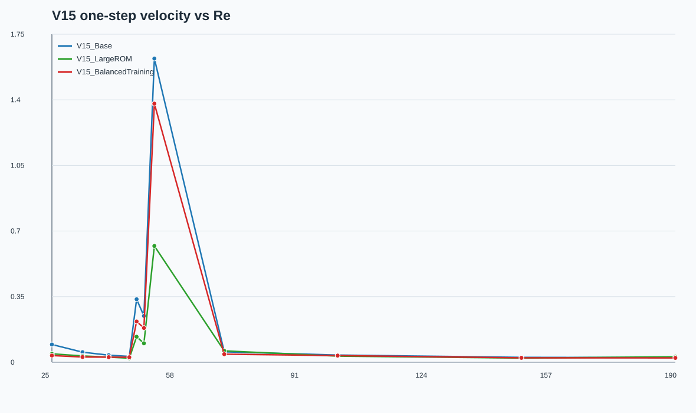
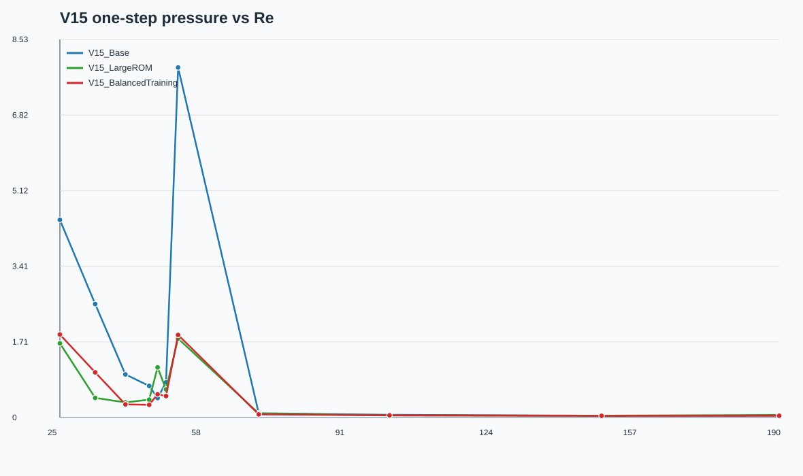
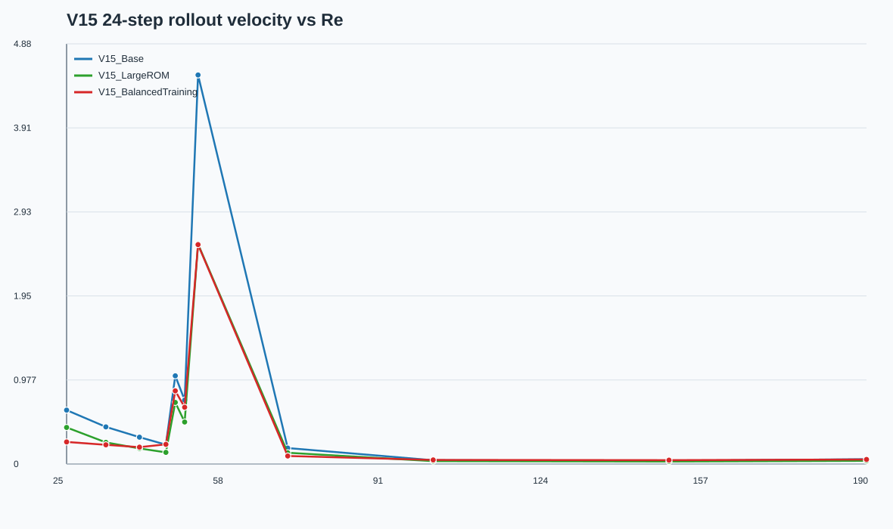
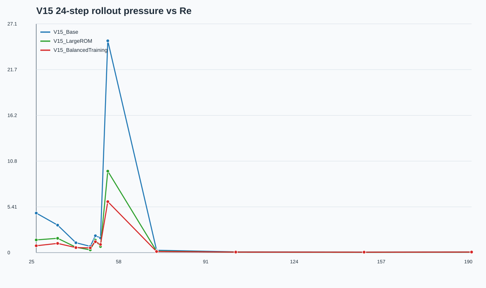
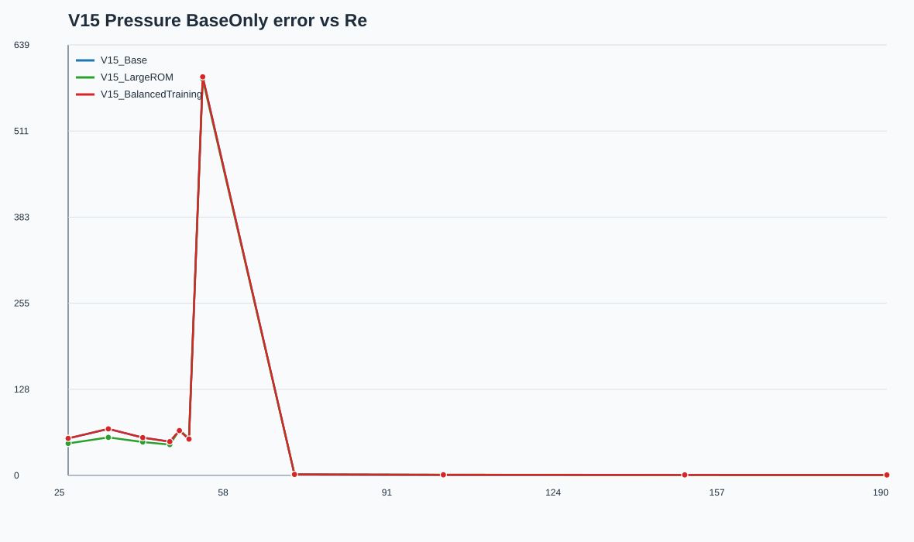
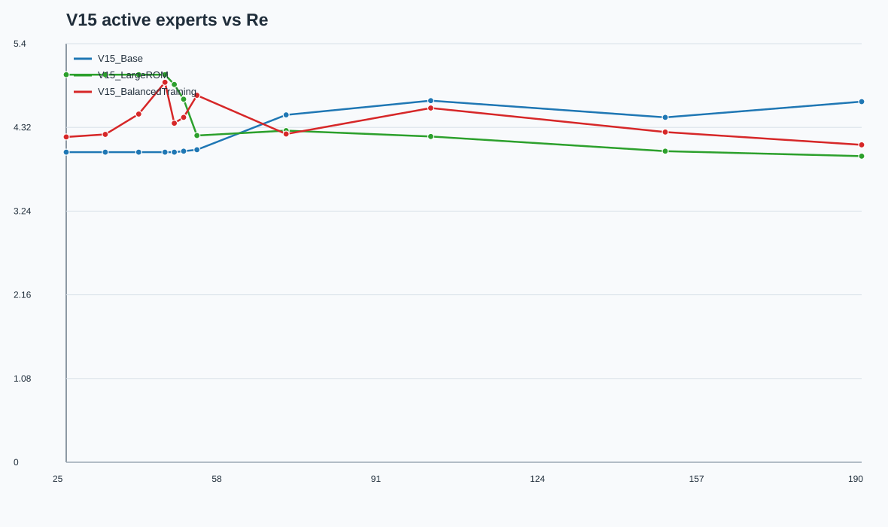

# V15 Physics-Generalizable 技术报告

生成日期：2026-07-05。实验目录：`/root/moe/V15_PhysicsGeneralizable/test_results_v15`；本地提交目录：`V15_PhysicsGeneralizable/`。

## 结论先行

- 三组实验均已完成：`V15_Base`、`V15_LargeROM`、`V15_BalancedTraining`。三者使用同一套 Re=20-200 Physics-Generalizable 数据库，保持 HPRS-MoE、Galerkin、RK4、Pressure Poisson Surrogate、`pressure_target=closure`、loss、优化器和训练流程一致。
- `V15_LargeROM` 是速度/RHS 最强方案：相对 `V15_Base`，平均 one-step velocity 降低 56.0%，24-step velocity 降低 39.3%，RHS 降低 57.0%。这说明新数据库的跨 regime 动力学确实需要更大的 ROM 空间。
- `V15_BalancedTraining` 是压力 rollout 最强方案：平均 24-step pressure 从 `V15_Base` 的 3.5577 降到 1.0598，相对降低 70.2%；压力能量误差降低 93.7%。这说明训练分布不均会显著影响压力长期稳定性。
- Periodic 区间已经比较稳，成熟周期流 Re≈100/149/190 的速度和压力 rollout 基本在 5%-8% 量级；Steady 与 Hopf 仍明显困难，特别是 Re≈51.786 的 Hopf 临界点，是所有方案最大的长期漂移来源。
- Pressure BaseOnly 在 Steady/Hopf 的误差非常大，Closure 能显著修正；ResidualOnly 也很差。因此压力瓶颈不是单独的 residual head，也不是简单 BaseOnly 精度，而是 Poisson surrogate 与 residual closure 的耦合在低 Re/Hopf 区间仍不稳。
- Expert 没有出现明显函数塌缩：三组 per-case summary 中 `collapse flag=False`，max |cos(expert_i, expert_j)| 均低于 0.95；但仍存在 dead expert 数量较高、group router entropy=0 的现象，说明 group 选择偏硬，专家池没有被完全均衡使用。

## 实验设置

| 项目 | 设置 |
|---|---|
| 数据库 | `/root/moe/ROM_PhysicsGeneralizable/data`，Re=20-200，共 100 个 Re |
| ROM/物理张量 | Weighted POD、Galerkin Tensor、Pressure Poisson Surrogate，全来自新数据库 |
| 主干 | Shared Encoder + HPRS-MoE + Physics-aware Experts + Galerkin residual RHS + RK4 |
| Expert | Linear + Low-rank Quadratic + Residual FFN |
| Router | Group Router 选 physics regime，group 内 Top-2 routed experts，并保留 shared expert |
| 时间推进 | RK4；训练 rollout curriculum 4/8/12/16，最终评测 24-step autonomous rollout |
| Pressure | `pressure_target=closure`，`b_pred=b_base+pressure_head`；`closure_mode=baseline`，所以 alpha=1、beta=0 |
| Pressure Head 输入 | `pressure_input_mode=pressure_only`；沿用 V14 当前最佳 `[a_t,b_t]` pressure state 逻辑 |
| 训练 | epochs=240，batch_size=256，lr=5.5e-4，weight_decay=1.5e-4，scheduled sampling 0 -> 0.85 |
| SwanLab | project=`V15_PhysicsGeneralizable`，三组训练已上传完成 |

三组实验只改变指定变量：

| Case | ROM | 采样策略 | Best epoch | Runtime |
|---|---:|---|---:|---:|
| V15_Base | ru=16, rp=16 | dense chronological samples | 190 | 10.27 h |
| V15_LargeROM | ru=32, rp=32 | dense chronological samples | 205 | 10.39 h |
| V15_BalancedTraining | ru=16, rp=16 | regime-balanced mini-batch | 215 | 10.43 h |

## 训练与推理流程图

```mermaid
flowchart TD
  A[ROM_PhysicsGeneralizable 数据库] --> B[Weighted POD / Galerkin Tensor / Poisson Surrogate]
  B --> C[Batch: a_t, b_t, Re, history, descriptors]
  C --> D[Shared Encoder]
  D --> E[Group Router: Steady / Hopf / Periodic]
  E --> F[Selected Group: Shared Expert + Top-2 Routed Experts]
  F --> G[Physics-aware velocity operator correction]
  G --> H[Galerkin RHS + learned residual RHS]
  H --> I[RK4 multi-step rollout: 4/8/12/16]
  I --> J[a_pred trajectory]
  J --> K[Pressure Base b_base(a_next, Re)]
  D --> L[Pressure Head residual]
  K --> M[b_pred = b_base + pressure_head]
  L --> M
  J --> N[coeff / RHS / rollout / energy / consistency loss]
  M --> N
  N --> O[SwanLab + JSON/CSV/SVG]
```

```mermaid
flowchart TD
  A0[a_t, b_t, Re, history] --> B0[Shared Encoder]
  B0 --> C0[Group Router]
  C0 --> D0[Group-local Shared Expert + Top-2 Routed Experts]
  D0 --> E0[Weighted local ROM operator]
  E0 --> F0[Galerkin + learned residual RHS]
  F0 --> G0[RK4 one step]
  G0 --> H0[a_{t+1}]
  H0 --> I0[Poisson Base b_base(a_{t+1}, Re)]
  B0 --> J0[Pressure residual head]
  I0 --> K0[b_{t+1}=b_base+residual]
  J0 --> K0
  K0 --> L0[Feed prediction back for autonomous 24-step rollout]
  H0 --> L0
  L0 --> A0
```

## 数据划分与 POD 能量

- Train Re: 89；Held-out Test Re: 11；Validation samples: 1547；Train samples: 10970；Test samples: 1350。
- `train_time_stride=1`，`train_re_stride=1`，即 V15_Base 与 V15_LargeROM 使用 dense 时间采样；BalancedTraining 只改变 mini-batch 采样权重，不改变数据本身。
- 16 维 ROM 已经覆盖 velocity 99.616%、pressure 99.437% 能量；32 维提升到 velocity 99.936%、pressure 99.929%。这个 0.3%-0.5% 的尾部能量对 Hopf/Steady 的长期稳定性影响很大。

| Held-out Re | Label | Regime | Group | Test samples |
|---:|---|---|---|---:|
| 24.630 | `Re_24p630436` | steady_wake | Steady | 61 |
| 32.740 | `Re_32p740068` | steady_wake | Steady | 61 |
| 39.685 | `Re_39p685479` | steady_wake | Steady | 61 |
| 45.143 | `Re_45p142703` | pre_hopf_steady | Steady | 61 |
| 47.081 | `Re_47p081355` | hopf_transition | Hopf | 158 |
| 49.022 | `Re_49p022357` | hopf_transition | Hopf | 158 |
| 51.786 | `Re_51p786450` | hopf_transition | Hopf | 158 |
| 70.315 | `Re_70p314635` | developing_periodic_shedding | Periodic | 158 |
| 100.352 | `Re_100p352251` | mature_periodic_shedding | Periodic | 158 |
| 149.059 | `Re_149p059229` | mature_periodic_shedding | Periodic | 158 |
| 189.862 | `Re_189p862278` | high_re_2d_periodic_near_modeA | Periodic | 158 |

## 总体指标

数值为 Held-out Re 上的 mean / std / min / max。

| Case | Metric | Mean | Std | Min | Max |
|---|---|---:|---:|---:|---:|
| V15_Base | 1-step velocity | 0.23345 | 0.44965 | 0.02502 | 1.6214 |
| V15_Base | 1-step pressure | 1.6423 | 2.3615 | 0.04057 | 7.8936 |
| V15_Base | 24-step velocity | 0.74618 | 1.2323 | 0.03638 | 4.5231 |
| V15_Base | 24-step pressure | 3.5577 | 6.9453 | 0.05494 | 25.067 |
| V15_Base | RHS L2 | 1.4795 | 1.5487 | 0.15111 | 4.5231 |
| V15_Base | 24-step pressure energy | 52.908 | 156.04 | 0.01164 | 546.12 |
| V15_Base | Active experts | 4.2083 | 0.27367 | 4.0000 | 4.6646 |
| V15_LargeROM | 1-step velocity | 0.10283 | 0.16740 | 0.02187 | 0.62073 |
| V15_LargeROM | 1-step pressure | 0.60357 | 0.61255 | 0.04066 | 1.7796 |
| V15_LargeROM | 24-step velocity | 0.45314 | 0.69708 | 0.02937 | 2.5567 |
| V15_LargeROM | 24-step pressure | 1.4827 | 2.6478 | 0.04320 | 9.6397 |
| V15_LargeROM | RHS L2 | 0.63563 | 0.43637 | 0.18570 | 1.3792 |
| V15_LargeROM | 24-step pressure energy | 7.8178 | 23.071 | 0.00559 | 80.743 |
| V15_LargeROM | Active experts | 4.5650 | 0.41407 | 3.9494 | 5.0000 |
| V15_BalancedTraining | 1-step velocity | 0.18406 | 0.38390 | 0.02346 | 1.3803 |
| V15_BalancedTraining | 1-step pressure | 0.59478 | 0.66109 | 0.03868 | 1.8719 |
| V15_BalancedTraining | 24-step velocity | 0.47304 | 0.70224 | 0.04504 | 2.5504 |
| V15_BalancedTraining | 24-step pressure | 1.0598 | 1.6278 | 0.05598 | 6.0305 |
| V15_BalancedTraining | RHS L2 | 0.88903 | 0.91178 | 0.15384 | 2.8691 |
| V15_BalancedTraining | 24-step pressure energy | 3.3487 | 9.2954 | 0.00451 | 32.698 |
| V15_BalancedTraining | Active experts | 4.4123 | 0.23601 | 4.0949 | 4.9016 |

相对 `V15_Base` 的平均误差降低比例：

| Case | 1-step u | 1-step p | 24-step u | 24-step p | RHS | pressure energy |
|---|---:|---:|---:|---:|---:|---:|
| V15_LargeROM | 56.0% | 63.2% | 39.3% | 58.3% | 57.0% | 85.2% |
| V15_BalancedTraining | 21.2% | 63.8% | 36.6% | 70.2% | 39.9% | 93.7% |

## Regime-aware Evaluation

| Regime group | Case | 1-step u | 1-step p | 24-step u | 24-step p | RHS |
|---|---|---:|---:|---:|---:|---:|
| Steady | V15_Base | 0.05442 | 2.1754 | 0.39852 | 2.4589 | 0.98103 |
| Steady | V15_LargeROM | 0.03204 | 0.71452 | 0.24819 | 1.0399 | 0.59415 |
| Steady | V15_BalancedTraining | 0.02949 | 0.86833 | 0.22612 | 0.76405 | 0.51867 |
| Hopf | V15_Base | 0.73506 | 3.0413 | 2.0974 | 9.6030 | 3.8654 |
| Hopf | V15_LargeROM | 0.28598 | 1.1814 | 1.2538 | 3.9447 | 1.2624 |
| Hopf | V15_BalancedTraining | 0.59360 | 0.95680 | 1.3537 | 2.7612 | 2.3154 |
| Periodic | V15_Base | 0.03628 | 0.06002 | 0.08043 | 0.12252 | 0.18861 |
| Periodic | V15_LargeROM | 0.03625 | 0.05929 | 0.05758 | 0.07898 | 0.20700 |
| Periodic | V15_BalancedTraining | 0.03146 | 0.04972 | 0.05942 | 0.07956 | 0.18960 |

解读：

- Steady：BalancedTraining 的 24-step velocity/pressure 最低，说明低 Re 稳态样本在 dense training 中权重不足，均衡采样能改善低 Re 压力与长期稳定。
- Hopf：LargeROM 给出最低 24-step velocity，BalancedTraining 给出最低 24-step pressure；说明 Hopf 附近同时受 ROM 容量和训练分布影响。
- Periodic：LargeROM 与 BalancedTraining 都优于 Base，LargeROM 略优；成熟周期流是当前框架最稳定的区域。

## Per-Re 24-step Rollout 对比

| Re | Regime | Base u/p | LargeROM u/p | Balanced u/p | Best velocity | Best pressure |
|---:|---|---:|---:|---:|---|---|
| 24.630 | steady_wake | 0.62643/4.6773 | 0.42551/1.5048 | 0.25688/0.81386 | V15_BalancedTraining | V15_BalancedTraining |
| 32.740 | steady_wake | 0.43102/3.2510 | 0.25102/1.6955 | 0.22312/1.0883 | V15_BalancedTraining | V15_BalancedTraining |
| 39.685 | steady_wake | 0.31196/1.1697 | 0.18118/0.63742 | 0.19614/0.59263 | V15_LargeROM | V15_BalancedTraining |
| 45.143 | pre_hopf_steady | 0.22468/0.73775 | 0.13505/0.32195 | 0.22836/0.56141 | V15_LargeROM | V15_LargeROM |
| 47.081 | hopf_transition | 1.0254/1.9981 | 0.71602/1.4744 | 0.85062/1.2899 | V15_LargeROM | V15_BalancedTraining |
| 49.022 | hopf_transition | 0.74364/1.7441 | 0.48878/0.72011 | 0.66020/0.96308 | V15_LargeROM | V15_LargeROM |
| 51.786 | hopf_transition | 4.5231/25.067 | 2.5567/9.6397 | 2.5504/6.0305 | V15_BalancedTraining | V15_BalancedTraining |
| 70.315 | developing_periodic_shedding | 0.18548/0.27592 | 0.13079/0.16943 | 0.09273/0.13328 | V15_BalancedTraining | V15_BalancedTraining |
| 100.352 | mature_periodic_shedding | 0.04355/0.08732 | 0.03311/0.05123 | 0.04755/0.06231 | V15_LargeROM | V15_LargeROM |
| 149.059 | mature_periodic_shedding | 0.03638/0.05494 | 0.02937/0.04320 | 0.04504/0.05598 | V15_LargeROM | V15_LargeROM |
| 189.862 | high_re_2d_periodic_near_modeA | 0.05632/0.07189 | 0.03704/0.05204 | 0.05237/0.06665 | V15_LargeROM | V15_LargeROM |

最硬的点是 `Re_51p786450`：`V15_Base` 24-step pressure=25.067，LargeROM 降到 9.640，BalancedTraining 进一步降到 6.030，但仍明显高于其它 Re。这个点在 Hopf transition 边界附近，模型不仅要插值参数，还要恢复振荡幅值/相位。

## Pressure Base / Residual / Closure 分析

| Case | BaseOnly mean | ResidualOnly mean | Closure mean | Closure vs Base | 24-step pressure |
|---|---:|---:|---:|---:|---:|
| V15_Base | 85.948 | 84.878 | 1.5716 | 98.2% | 3.5577 |
| V15_LargeROM | 83.017 | 83.231 | 0.57301 | 99.3% | 1.4827 |
| V15_BalancedTraining | 85.948 | 86.091 | 0.55108 | 99.4% | 1.0598 |

关键判断：

- 新数据库的 Pressure Poisson Base 在 Periodic 区间可用，典型 BaseOnly 约 0.7-1.4；但在 Steady/Hopf 区间 BaseOnly 可达 45-591，相当不稳定。
- ResidualOnly 与 BaseOnly 同样大，说明 pressure head 不是在单独重建压力，而是在 closure 中与 base 发生强耦合修正。
- Closure 将 BaseOnly 平均误差从 80+ 降到 0.55-1.57，说明 residual closure 是必要的；但低 Re/Hopf 仍有较大压力误差，下一步应优先诊断 Poisson surrogate 的低 Re/Hopf 泛化和 residual target 的尺度/相位一致性。
- 本轮 V15 采用 `closure_mode=baseline`，alpha=1、beta=0；Adaptive Base Confidence 没有启用，是因为前一轮 V14 Adaptive 并未成为均值最优方案。

## Router / Expert 可解释性

| Case | Active experts mean | Router entropy mean | Max expert cosine | Collapse flag |
|---|---:|---:|---:|---|
| V15_Base | 4.2083 | 1.0521 | 0.91362 | False |
| V15_LargeROM | 4.5650 | 1.0118 | 0.82654 | False |
| V15_BalancedTraining | 4.4123 | 1.0401 | 0.86454 | False |

- 三组 group diagnostics 都显示 selected group 内包含 shared expert，满足“每组 1 个 shared expert + routed experts”的 HPRS-MoE 设计。
- `group_router_entropy=0` 表明 group 选择非常硬；从 per-case summary 可见 group load 随 Re 变化，例如 Base 在 Steady 主要走 group 2，Hopf 主要走 group 0，Periodic 高 Re 主要走 group 1。
- max |cos(expert_i, expert_j)| 均 <0.95，未触发 collapse flag；BalancedTraining 的最大相似度最低，说明均衡采样有助于专家多样性。
- 仍存在 10-18 个低负载专家，说明路由监督和 load-balance 还可以加强，尤其是 group 内专家的有效利用率。

## 曲线与产物

跨实验曲线：








每组详细结果：

- `test_results_v15/results/V15_Base/V15_Base_physics_generalizable_ru16_rp16/`
- `test_results_v15/results/V15_LargeROM/V15_LargeROM_physics_generalizable_ru32_rp32/`
- `test_results_v15/results/V15_BalancedTraining/V15_BalancedTraining_physics_generalizable_ru16_rp16/`
- 汇总 CSV：`test_results_v15/results/V15_summary/v15_physics_generalizable_combined.csv`

## 尚未覆盖的物理指标

本次代码保留了用户要求的 coefficient/RHS/rollout/pressure energy/router/expert 指标，但没有真正输出 Lift/Drag 曲线和 Strouhal number。原因是当前提交到训练脚本的 ROM coefficient 数据与张量文件中没有直接的 lift/drag/force probe 数组；我也在远端数据目录中没有找到匹配 `lift|drag|force|strouhal` 的文件。因此本报告不能把 POD 系数频率代理冒充为真实 Strouhal。后续若能提供 Cl/Cd 或探针速度/压力时间序列，应把它们接入 `evaluate_rollout`：

- Steady：报告 mean-flow error 与残差能量；
- Hopf：报告振荡恢复幅值、相位漂移、临界频率；
- Periodic：报告 Cl/Cd 曲线、Strouhal frequency、周期稳定性。

## 最终判断

新的 Physics-Generalizable 数据库确实把问题从“单一周期流参数插值”推进到了 Steady/Hopf/Periodic 的物理泛化。结果显示当前瓶颈不是单一来源：

- ROM 容量不足是速度/RHS 与 Hopf transition 的主要瓶颈之一，`ru/rp=32` 明显优于 `16`。
- 训练数据分布不均是压力 rollout 和低 Re 稳态泛化的重要瓶颈，regime-balanced sampling 明显改善 Steady/Hopf 压力。
- Pressure Poisson Surrogate 在低 Re/Hopf 的 BaseOnly 误差过大，是压力分支的结构性风险；Closure 能修，但会形成强耦合，不应长期依赖 residual head 去抵消一个很差的 base。
- 下一轮建议不是简单继续放大网络，而是组合 `ru/rp=32 + regime-balanced sampling`，并增加真实力系数/Strouhal 评测；压力侧优先做 low-Re/Hopf 专门的 Poisson surrogate calibration 或 regime-conditioned pressure base。
