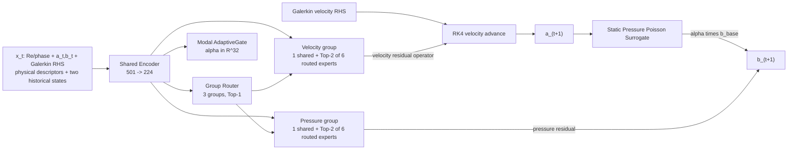

# V16_1_SteadyPressureAnchor32 网络、参数与问题梳理

## 1. 当前定位

`V16_1_SteadyPressureAnchor32` 是目前 V16_1 系列中最适合作为后续实验对照组的版本，但它不是“steady pressure 已解决”的版本。它保留 V16 FullRegimeLoss32 的 HPRS-MoE-ROM 主干，只在 steady attractor 的多步训练中增加五项压力 anchor loss。

已完成 held-out 评测的总体均值为：one-step velocity `3.99%`、one-step pressure `12.29%`、24-step velocity `22.57%`、24-step pressure `29.67%`。因此它仍未达到速度和压力长期误差均小于 10% 的目标。

## 2. 端到端架构



速度不是直接预测下一状态：

```text
f_u(a_t,b_t,Re) = GalerkinRHS(a_t,b_t,Re) + VelocityMoE(h_t,a_t)
a_(t+1) = RK4(f_u, a_t, dt)
```

压力 closure 为：

```text
b_base = c_tilde(Re) + A_tilde(Re) a_(t+1) + H_tilde(a_(t+1),a_(t+1))
pressure_residual = PressureMoE(h_t,[a_t,b_t])
alpha = sigmoid(ConfidenceHead(h_t)) in R^32
b_(t+1) = alpha * b_base + pressure_residual
```

注意：这里没有 `+ b_base` 的固定权重 1；Poisson Base 先被 32 维 `alpha` 按模态缩放。

## 3. 数据与输入参数

| 项目 | 当前值 |
|---|---:|
| 数据库 | Re=20-200 Physics-Generalizable Attractor Database |
| 总 Re | 100 |
| train / held-out Re | 89 / 11 |
| train / validation / test samples | 10970 / 1547 / 1350 |
| train time stride / Re stride | 1 / 1 |
| velocity / pressure ROM | `ru=32`, `rp=32` |
| history length | 3 |
| phase harmonics | 4 |
| encoder input dimension | 501 |

Held-out Re：

```text
24.630, 32.740, 39.685, 45.143,
47.081, 49.022, 51.786,
70.315, 100.352, 149.059, 189.862
```

当前时刻基础特征包含 Re、`1/Re`、相位 Fourier 特征、`a_t`、`b_t`、Galerkin RHS、模态分段范数、速度/压力能量及能量比例。随后加入前两个历史时刻的 `a,b,RHS` 及其相对当前时刻的变化量。所有输入标准化统计只从训练样本拟合。

## 4. Shared Encoder 与 Router

Shared Encoder：

```text
Linear(501,224) -> LayerNorm -> SiLU -> Dropout(0.04)
Linear(224,224) -> LayerNorm -> SiLU -> Dropout(0.04)
Linear(224,224) -> LayerNorm -> SiLU
+ 2 x residual refinement block
```

Router 参数：

| 参数 | 当前值 |
|---|---:|
| physics groups | 3 |
| routed experts per group | 6 |
| shared experts per group | 1 |
| group top-k | 1 |
| in-group top-k | 2 |
| routed temperature | 0.95 |
| group temperature | 0.90 |
| gate floors | 0 |
| shared scale | 1.0 |
| routed scale | 0.85 |

Velocity 和 Pressure 有各自的 group 内 router 与 experts，但共用 Shared Encoder 和 Group Router。每个分支有 `3 x (1 shared + 6 routed) = 21` 个专家；两分支合计 42 个 PhysicsAwareExpert。

所谓“共享专家”是组内共享：每个被选中的 physics group 总会激活本组 shared expert。当前没有跨三个 group 都始终激活的 global shared expert。

组内输出权重固定为：

```text
shared_part = 1.0 / (1.0 + 0.85) = 0.54054
routed_part = 0.85 / (1.0 + 0.85) = 0.45946
```

## 5. Physics-aware Expert

每个 expert 保持同一结构：

```text
z = Linear(LayerNorm(concat(h,state)), 224) -> GELU
z = 3 x ExpandedFFNBlock(224 -> 768 -> 224)
output = LinearHead(z)
       + Linear(state)
       + 0.05 * LowRankQuadratic_rank4(state,state)
```

| 分支 | state dim | output dim |
|---|---:|---:|
| velocity | 32 (`a_t`) | 32（velocity RHS residual） |
| pressure | 64 (`[a_t,b_t]`) | 32（pressure residual） |

`pressure_input_mode=pressure_only` 这个命名容易误解：在当前实现中它实际使用 `[a_t,b_t]`，不是只有 `b_t`，也不是 `a_(t+1)` 或 `[a_(t+1),b_base]`。

按 `input_dim=501` 和当前源码静态计数，模型约有 `48,617,547` 个可训练参数。绝大部分来自 velocity/pressure 两套共 42 个 expert；这不是一个小模型。

## 6. Pressure Base 与 AdaptiveGate

| 参数 | 当前值 |
|---|---|
| pressure target | closure |
| pressure base mode | static |
| pressure input | `[a_t,b_t]` |
| confidence input | shared latent `h_t` |
| confidence head | `Linear(224,64) -> GELU -> Linear(64,32) -> Sigmoid` |
| beta | 0 |

实际评测表明：

- 全部 held-out Re 的 raw Pressure Base relative L2 均值为 `83.02`。
- steady 的 `alpha` 均值只有 `0.0628`，Periodic 为 `0.5566`。
- steady 的 base contribution ratio 约 `0.210`，residual contribution ratio 约 `1.026`。

这意味着模型在 low-Re steady/Hopf 区域主要靠 Pressure Head 重建压力，AdaptiveGate 主要负责压低不可靠 Base；Pressure Base 并未成为稳定的主导物理先验。

## 7. 训练参数

| 参数 | 当前值 |
|---|---:|
| optimizer | AdamW |
| learning rate | `5.5e-4` |
| weight decay | `1.5e-4` |
| batch size | 256 |
| epochs / min epochs | 240 / 130 |
| patience | 70 |
| eval interval | 5 epochs |
| seed | 1600 |
| gradient clipping | 1.0 |
| TF32 | enabled |
| training rollout batch | 2 |
| rollout curriculum | 4 -> 8 -> 12 -> 16 |
| final evaluation | 24-step autonomous rollout |
| scheduled sampling | 0 -> 0.85，前 70% epoch 线性增加 |

原实验完成 240 epoch，best epoch 为 225，`best_val_score=0.48209`，总耗时 `41547 s`，约 `11.54 h`。

## 8. Loss 结构

通用主损失主要权重：

| Loss | 权重 |
|---|---:|
| coefficient | 0.75 |
| dynamics RHS | 0.90 |
| pressure | 0.95 |
| rollout | 0.45 |
| pressure rollout inside rollout | 0.45 |
| energy | 0.05 |
| trajectory consistency | 0.18 |
| pressure relative | 0.70 |
| RHS relative | 0.06 |
| alpha relative | 0.04 |
| router balance | 0.06 |
| group balance / supervision | 0.04 / 0.04 |
| router smoothness | 0.04 |
| expert diversity | 0.006 |

V16 attractor loss 仍保留 steady fixed-state、Hopf radius/overshoot/onset、Periodic energy/radius 约束。

本 case 新增的五项 steady rollout loss：

| Loss | 权重 | 作用 |
|---|---:|---|
| pressure state anchor | 0.02 | 靠近真实下一步压力 |
| pressure mean anchor | 0.02 | 靠近该训练 Re 的平均压力状态 |
| pressure delta damping | 0.01 | 抑制 equilibrium 附近自发变化 |
| residual damping | 0.01 | 限制 Pressure Head 残差幅值 |
| pressure energy consistency | 0.01 | 限制压力模态能量漂移 |

这些 loss 只在 `steady_wake` 和 `pre_hopf_steady` 的 rollout step 上生效，且本 case `warmup=0`，从 epoch 1 起全权重启用。

## 9. 当前结果

| Regime | one-step u | one-step p | 24-step u | 24-step p | pressure energy drift | alpha |
|---|---:|---:|---:|---:|---:|---:|
| Overall | 0.0399 | 0.1229 | 0.2257 | 0.2967 | 0.3143 | 0.2421 |
| Steady | 0.0155 | 0.1516 | 0.1998 | 0.4071 | 0.5686 | 0.0628 |
| Hopf | 0.0766 | 0.1825 | 0.4953 | 0.4627 | 0.3747 | 0.0619 |
| Periodic | 0.0369 | 0.0495 | 0.0493 | 0.0618 | 0.0149 | 0.5566 |

最困难测试点：

- `Re=24.630`：24-step velocity `0.3061`，pressure `0.6274`，pressure energy error `1.270`。
- `Re=47.081`：24-step velocity `0.5925`，Hopf overshoot mean `9.91x`。
- `Re=51.786`：24-step velocity `0.6063`，pressure `0.6603`。

Periodic 已接近或进入 10% 目标；Steady pressure 和 Hopf velocity/pressure 是当前主要瓶颈。

## 10. 已确认的问题

### P0：checkpoint 选择没有使用 rollout 指标

当前：

```text
val_score = RHS relative L2
          + one-step velocity relative L2
          + 0.35 * one-step pressure-head relative L2
```

它不包含 autonomous rollout、pressure energy drift 或 steady pressure anchor 指标。因此 best epoch 225 只表示一步验证分数最好，不保证 24-step 最稳。后续应至少保存一个 rollout-aware checkpoint，或并行保存 `best_one_step` 与 `best_rollout`。

### P0：rollout 起点没有做 attractor-balanced sampling

普通 mini-batch 使用 inverse-frequency attractor sampling，期望 Steady/Hopf/Periodic 各约 1/3；但 rollout 起点从 `train_roll_starts` 均匀抽取。原始 rollout pool 为：

```text
Steady 813, Hopf 1949, Periodic 8208
```

因此 rollout 抽样约为 `7.4% / 17.8% / 74.8%`。steady pressure anchor 只在 rollout 中生效，却只得到约 7.4% 的起点，训练目标和采样策略不匹配。

### P0：Low-Re Pressure Base 本身不可靠

raw Pressure Base error 极高，gate 被迫把 steady/Hopf alpha 压到约 0.062。最终压力几乎由 residual/head 承担，导致闭环时小偏差不断回灌到下一步 `[a_t,b_t]` 输入。继续只加强 residual damping 很可能牺牲拟合能力，不能修复 Base。

### P1：Steady pressure anchor 没有真正消除长期漂移

Steady one-step pressure 为 `15.16%`，24-step pressure 为 `40.71%`；`Re=24.630` 达到 `62.74%`。与 V16_1 HopfOnset 对照相比，SteadyPressureAnchor 的 steady pressure rollout 和 pressure energy 并未改善，说明目前五项 loss 的采样量、尺度或作用位置仍不够。

### P1：Hopf near-onset 仍有 false oscillation

`Re=47.081` 的真实主模态半径接近零，预测 overshoot 仍约 `9.91x`；`Re=49.022` 约 `4.24x`。标准 relative L2 受小分母放大，但预测半径确实也过大，二者同时存在。

### P1：Router/Expert 使用退化

Steady/Hopf 的 top1 全部为 expert 0，active experts mean 为 3，dead experts 为 18；Periodic 才会明显使用 e7/e14。`active expert count` 会把 shared expert 和 top-2 路由一起计入，不能证明专家分工健康。应固定报告 top1、top2、mean load、group load 与 dead experts by regime。

### P1：Group Router 是硬 Top-1

`group_top_k=1` 且无 gate floor，使临界 Re 的 group 切换不连续；`group_entropy=0` 是结构设定造成的，不代表 router 置信度充分。Near-Hopf 状态可能需要 soft Top-2 group routing 或 shared global path。

### P1：RK4 子步只更新速度，压力状态在子步内冻结

RK4 的 `k2/k3/k4` 会更新 `a`，但继续使用同一个 `b_state`；压力只在完整速度步结束后由 Poisson Base + residual 更新。这保留了速度对压力的依赖，却不是完全耦合的速度-压力 RK4，可能放大 pressure/velocity phase mismatch。

### P2：训练计算路径低效

- 训练 rollout batch 只有 2，RK4 每步需要 4 次模型/RHS 调用，16-step curriculum 后 Python 调度占比高。
- sparse expert dispatch 使用 Python 循环和布尔索引，产生许多小 kernel。
- 为 diversity loss，每个普通 batch 还会对前 32 个样本额外运行所有 routed experts。
- 单文件 6548 行，同时包含 FiLM、Regime ROM、Attractor Adapter 等未启用路径，维护和验证成本高。

这些是之前 GPU 利用率偏低、一次训练约 11.5 小时的主要代码侧原因。

## 11. 建议的重新梳理顺序

1. 先修评估与采样：增加 rollout-aware checkpoint selection，并让 rollout start 按 attractor 平衡抽样。这不改变模型，可直接判断 anchor 是否被训练充分。
2. 分离 pressure 稳定性问题：同时记录 `b_pred-b_true`、`b_pred-b_mean`、base/residual contribution、alpha time series，确认漂移来自 residual 还是 base 注入。
3. 对 steady pressure 使用 equilibrium/contractive 约束时，把约束施加在闭环 map `Phi(a,b)` 上，而不只惩罚单步 residual 幅值。
4. Router 先做诊断再改结构。若 top2 仍集中，再尝试 soft group Top-2 或 global shared expert；不要先增加专家数量。
5. Pressure Base 应独立重建/校准。当前 gate 只是屏蔽坏 Base，无法把它变成可泛化物理先验。
6. 性能优化放在数学逻辑冻结之后：批量化 expert dispatch、提高 rollout batch、减少每 batch 全专家 diversity forward，并用 profiler 验证。

## 12. 代码定位

- 参数解析：[`train_v16_1_steady_pressure_anchor32.py`](train_v16_1_steady_pressure_anchor32.py#L79)
- 输入特征：[`train_v16_1_steady_pressure_anchor32.py`](train_v16_1_steady_pressure_anchor32.py#L1006)
- PhysicsAwareExpert：[`train_v16_1_steady_pressure_anchor32.py`](train_v16_1_steady_pressure_anchor32.py#L1389)
- OperatorSpaceMoEROM：[`train_v16_1_steady_pressure_anchor32.py`](train_v16_1_steady_pressure_anchor32.py#L1457)
- RK4 closed-loop：[`train_v16_1_steady_pressure_anchor32.py`](train_v16_1_steady_pressure_anchor32.py#L3377)
- Steady pressure losses：[`train_v16_1_steady_pressure_anchor32.py`](train_v16_1_steady_pressure_anchor32.py#L3495)
- checkpoint score：[`train_v16_1_steady_pressure_anchor32.py`](train_v16_1_steady_pressure_anchor32.py#L5631)
- 冻结训练命令：[`run_train.sh`](run_train.sh)
